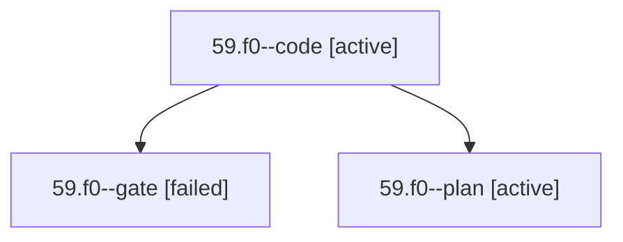

# Session: 59.f0

[Agent Hoods](../README.md) / [bbugyi200](../users/bbugyi200/README.md) / [apollo](../users/bbugyi200/machines/apollo/README.md) / [59](../users/bbugyi200/machines/apollo/hoods/59/README.md) / 59.f0

Owner: `bbugyi200.apollo` · Hood: `59` · Members: 3

## Lineage

The diagram is an optional enhancement; the ordered table below contains the same lineage in accessible text.

| Role | Agent | State | Model / provider | Timing | Commits | Prompt | Chat |
|---|---|---|---|---|---:|---|---|
| code | 59.f0--code | active | muse-spark-1.3-contributor / muse | 2026-10-05T19:08:30.936091+00:00 | 0 | — | — |
| gate | 59.f0--gate | failed | gpt-6-astra / codex | 2026-10-05T19:08:15.866999+00:00 → 2026-10-05T19:08:24.110111+00:00 | 0 | — | [Chat](../agents/bbugyi200.apollo.59.f0--gate/chat.md) |
| plan | 59.f0--plan | active | gpt-6-astra / codex | 2026-10-05T19:04:02.992827+00:00 | 0 | [Prompt](../agents/bbugyi200.apollo.59.f0--plan/prompt.md) | [Chat](../agents/bbugyi200.apollo.59.f0--plan/chat.md) |

## Neighbors

| Agent | Relation | State |
|---|---|---|
| [59](../agents/bbugyi200.apollo.59/README.md) | ancestor | completed |
