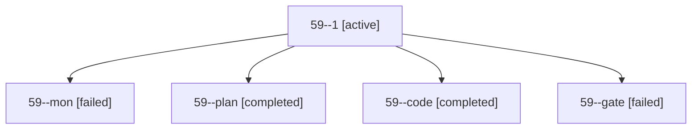

# Session: 59

[Agent Hoods](../README.md) / [bbugyi200](../users/bbugyi200/README.md) / [apollo](../users/bbugyi200/machines/apollo/README.md) / [59](../users/bbugyi200/machines/apollo/hoods/59/README.md) / 59

Owner: `bbugyi200.apollo` · Hood: `59` · Members: 5

## Lineage

The diagram is an optional enhancement; the ordered table below contains the same lineage in accessible text.

| Role | Agent | State | Model / provider | Timing | Commits | Prompt | Chat |
|---|---|---|---|---|---:|---|---|
| 1 | 59--1 | active | muse-spark-1.3-contributor / muse | 2026-10-05T18:50:21.371409+00:00 | 0 | [Prompt](../agents/bbugyi200.apollo.59--1/prompt.md) | — |
| mon | 59--mon | failed | muse-spark-1.3-contributor / muse | 2026-10-05T18:49:24.326286+00:00 → 2026-10-05T18:50:21.442939+00:00 | 0 | — | [Chat](../agents/bbugyi200.apollo.59--mon/chat.md) |
| plan | 59--plan | completed | opus / claude | 2026-10-05T18:38:21.798939+00:00 → 2026-10-05T18:49:55.511273+00:00 | 0 | [Prompt](../agents/bbugyi200.apollo.59--plan/prompt.md) | [Chat](../agents/bbugyi200.apollo.59--plan/chat.md) |
| code | 59--code | completed | muse-spark-1.3-contributor / muse | 2026-10-05T18:42:58.221263+00:00 → 2026-10-05T18:49:55.511273+00:00 | 0 | — | [Chat](../agents/bbugyi200.apollo.59--code/chat.md) |
| gate | 59--gate | failed | opus / claude | 2026-10-05T18:42:42.365993+00:00 → 2026-10-05T18:42:51.226903+00:00 | 0 | — | [Chat](../agents/bbugyi200.apollo.59--gate/chat.md) |

## Commits

| Role | Repo | Commit | Subject | Committed |
|---|---|---|---|---|
| — | bob-cli | [`e7b1e3a`](https://github.com/bobs-org/bob-cli/commit/e7b1e3a1a3274c5f797e24fc526f0ca927818cc7) | fix(projects): preserve hidden project task when scheduled | 2026-07-11 07:54:57 EDT |
