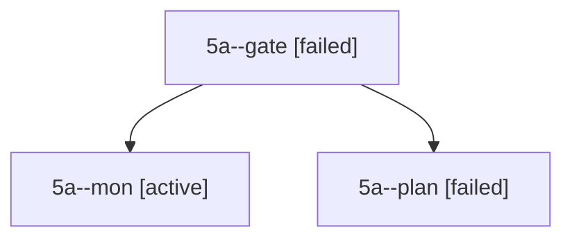

# Session: 5a

[Agent Hoods](../README.md) / [bbugyi200](../users/bbugyi200/README.md) / [apollo](../users/bbugyi200/machines/apollo/README.md) / [5a](../users/bbugyi200/machines/apollo/hoods/5a/README.md) / 5a

Owner: `bbugyi200.apollo` · Hood: `5a` · Members: 3

## Lineage

The diagram is an optional enhancement; the ordered table below contains the same lineage in accessible text.

| Role | Agent | State | Model / provider | Timing | Commits | Prompt | Chat |
|---|---|---|---|---|---:|---|---|
| gate | 5a--gate | failed | opus / claude | 2026-10-05T19:13:09.648655+00:00 → 2026-10-05T19:13:17.424240+00:00 | 0 | — | [Chat](../agents/bbugyi200.apollo.5a--gate/chat.md) |
| mon | 5a--mon | active | opus / claude | 2026-10-05T19:13:16.709107+00:00 | 0 | — | — |
| plan | 5a--plan | failed | opus / claude | 2026-10-05T18:44:50.015190+00:00 → 2026-10-05T19:13:21.343820+00:00 | 0 | [Prompt](../agents/bbugyi200.apollo.5a--plan/prompt.md) | [Chat](../agents/bbugyi200.apollo.5a--plan/chat.md) |
