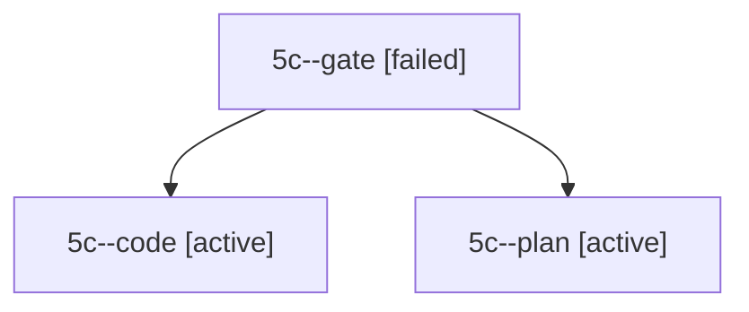

# Session: 5c

[Agent Hoods](../README.md) / [bbugyi200](../users/bbugyi200/README.md) / [apollo](../users/bbugyi200/machines/apollo/README.md) / [5c](../users/bbugyi200/machines/apollo/hoods/5c/README.md) / 5c

Owner: `bbugyi200.apollo` · Hood: `5c` · Members: 3

## Lineage

The diagram is an optional enhancement; the ordered table below contains the same lineage in accessible text.

| Role | Agent | State | Model / provider | Timing | Commits | Prompt | Chat |
|---|---|---|---|---|---:|---|---|
| gate | 5c--gate | failed | opus / claude | 2026-10-06T14:31:04.399624+00:00 → 2026-10-06T14:31:13.808942+00:00 | 0 | — | [Chat](../agents/bbugyi200.apollo.5c--gate/chat.md) |
| code | 5c--code | active | muse-spark-1.3-contributor / muse | 2026-10-06T14:31:21.765558+00:00 | [1](../agents/bbugyi200.apollo.5c--code/README.md#commits) | — | — |
| plan | 5c--plan | active | opus / claude | 2026-10-06T14:23:42.366738+00:00 | 0 | [Prompt](../agents/bbugyi200.apollo.5c--plan/prompt.md) | [Chat](../agents/bbugyi200.apollo.5c--plan/chat.md) |

## Commits

| Role | Repo | Commit | Subject | Committed |
|---|---|---|---|---|
| code | bob-cli | [`ea92b38`](https://github.com/bobs-org/bob-cli/commit/ea92b38c73e0bd0a942d785348e75e5c655aa20d) | docs(memory): define Area Note glossary strand with area-or-project containment rule | 2026-10-06 10:35:14 EDT |
