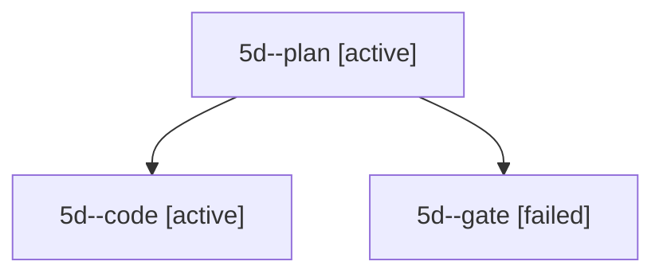

# Session: 5d

[Agent Hoods](../README.md) / [bbugyi200](../users/bbugyi200/README.md) / [apollo](../users/bbugyi200/machines/apollo/README.md) / [5d](../users/bbugyi200/machines/apollo/hoods/5d/README.md) / 5d

Owner: `bbugyi200.apollo` · Hood: `5d` · Members: 3

## Lineage

The diagram is an optional enhancement; the ordered table below contains the same lineage in accessible text.

| Role | Agent | State | Model / provider | Timing | Commits | Prompt | Chat |
|---|---|---|---|---|---:|---|---|
| plan | 5d--plan | active | opus / claude | 2026-10-06T14:24:32.622008+00:00 | 0 | [Prompt](../agents/bbugyi200.apollo.5d--plan/prompt.md) | [Chat](../agents/bbugyi200.apollo.5d--plan/chat.md) |
| code | 5d--code | active | muse-spark-1.3-contributor / muse | 2026-10-06T14:29:14.904017+00:00 | 0 | — | — |
| gate | 5d--gate | failed | opus / claude | 2026-10-06T14:28:56.744896+00:00 → 2026-10-06T14:29:06.767044+00:00 | 0 | — | [Chat](../agents/bbugyi200.apollo.5d--gate/chat.md) |

## Commits

| Role | Repo | Commit | Subject | Committed |
|---|---|---|---|---|
| — | bob-cli | [`4467e07`](https://github.com/bobs-org/bob-cli/commit/4467e07ab88689361ab149e7cc0169c7a8854ee1) | chore: Add SDD prompt and plan for obsidian\_ctrl\_shift\_bracket\_task\_toggle | 2026-06-11 10:26:10 EDT |

## Neighbors

| Agent | Relation | State |
|---|---|---|
| [5d.f0](../agents/bbugyi200.apollo.5d.f0/README.md) | descendant | active |
