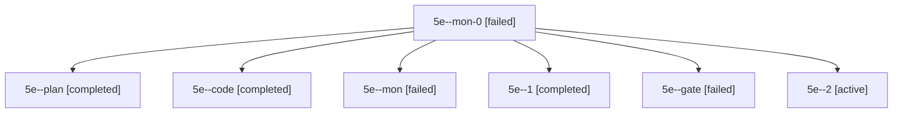

# Session: 5e

[Agent Hoods](../README.md) / [bbugyi200](../users/bbugyi200/README.md) / [apollo](../users/bbugyi200/machines/apollo/README.md) / [5e](../users/bbugyi200/machines/apollo/hoods/5e/README.md) / 5e

Owner: `bbugyi200.apollo` · Hood: `5e` · Members: 7

## Lineage

The diagram is an optional enhancement; the ordered table below contains the same lineage in accessible text.

| Role | Agent | State | Model / provider | Timing | Commits | Prompt | Chat |
|---|---|---|---|---|---:|---|---|
| mon-0 | 5e--mon-0 | failed | muse-spark-1.3-contributor / muse | 2026-10-06T15:15:29.108355+00:00 → 2026-10-06T15:16:45.495547+00:00 | 0 | — | [Chat](../agents/bbugyi200.apollo.5e--mon-0/chat.md) |
| plan | 5e--plan | completed | opus / claude | 2026-10-06T14:53:44.142488+00:00 → 2026-10-06T15:09:03.713661+00:00 | 0 | [Prompt](../agents/bbugyi200.apollo.5e--plan/prompt.md) | [Chat](../agents/bbugyi200.apollo.5e--plan/chat.md) |
| code | 5e--code | completed | muse-spark-1.3-contributor / muse | 2026-10-06T15:05:20.034929+00:00 → 2026-10-06T15:09:03.713661+00:00 | 0 | — | [Chat](../agents/bbugyi200.apollo.5e--code/chat.md) |
| mon | 5e--mon | failed | muse-spark-1.3-contributor / muse | 2026-10-06T15:08:25.064662+00:00 → 2026-10-06T15:09:41.711887+00:00 | 0 | — | [Chat](../agents/bbugyi200.apollo.5e--mon/chat.md) |
| 1 | 5e--1 | completed | muse-spark-1.3-contributor / muse | 2026-10-06T15:09:41.629668+00:00 → 2026-10-06T15:16:04.061245+00:00 | 0 | [Prompt](../agents/bbugyi200.apollo.5e--1/prompt.md) | [Chat](../agents/bbugyi200.apollo.5e--1/chat.md) |
| gate | 5e--gate | failed | opus / claude | 2026-10-06T15:05:00.188916+00:00 → 2026-10-06T15:05:10.496593+00:00 | 0 | — | [Chat](../agents/bbugyi200.apollo.5e--gate/chat.md) |
| 2 | 5e--2 | active | muse-spark-1.3-contributor / muse | 2026-10-06T15:16:44.983241+00:00 | 0 | [Prompt](../agents/bbugyi200.apollo.5e--2/prompt.md) | — |

## Commits

| Role | Repo | Commit | Subject | Committed |
|---|---|---|---|---|
| — | bob-cli | [`a2a9d2d`](https://github.com/bobs-org/bob-cli/commit/a2a9d2d97ea4baf7f70671ff935bca2e4557a897) | chore: Add SDD prompt and plan for obsidian\_ctrl\_jk\_header\_navigation | 2026-06-11 11:11:46 EDT |
| — | bob-cli | [`b6a9b4c`](https://github.com/bobs-org/bob-cli/commit/b6a9b4cdbd3d65530081c20ae9315f4332d55110) | docs: document project scheduling from lifecycle tasks | 2026-07-11 09:00:39 EDT |
