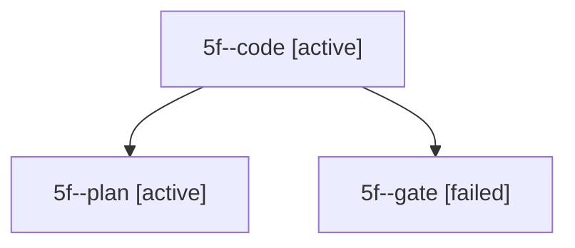

# Session: 5f

[Agent Hoods](../README.md) / [bbugyi200](../users/bbugyi200/README.md) / [apollo](../users/bbugyi200/machines/apollo/README.md) / [5f](../users/bbugyi200/machines/apollo/hoods/5f/README.md) / 5f

Owner: `bbugyi200.apollo` · Hood: `5f` · Members: 3

## Lineage

The diagram is an optional enhancement; the ordered table below contains the same lineage in accessible text.

| Role | Agent | State | Model / provider | Timing | Commits | Prompt | Chat |
|---|---|---|---|---|---:|---|---|
| code | 5f--code | active | muse-spark-1.3-contributor / muse | 2026-10-06T15:08:20.534367+00:00 | 0 | — | — |
| plan | 5f--plan | active | gpt-6-astra / codex | 2026-10-06T15:03:02.140877+00:00 | 0 | [Prompt](../agents/bbugyi200.apollo.5f--plan/prompt.md) | [Chat](../agents/bbugyi200.apollo.5f--plan/chat.md) |
| gate | 5f--gate | failed | gpt-6-astra / codex | 2026-10-06T15:07:59.650469+00:00 → 2026-10-06T15:08:11.800430+00:00 | 0 | — | [Chat](../agents/bbugyi200.apollo.5f--gate/chat.md) |
