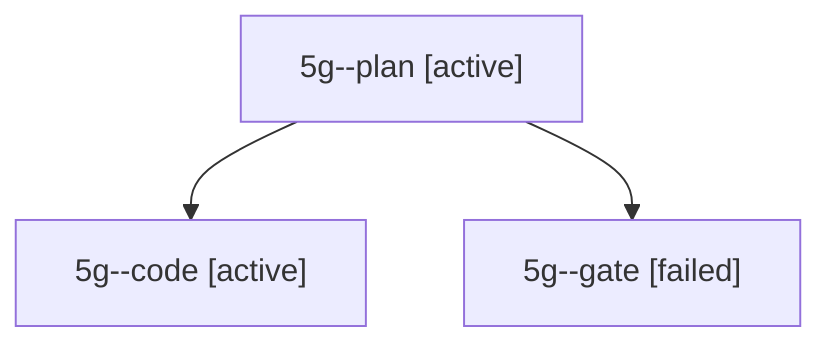

# Session: 5g

[Agent Hoods](../README.md) / [bbugyi200](../users/bbugyi200/README.md) / [apollo](../users/bbugyi200/machines/apollo/README.md) / [5g](../users/bbugyi200/machines/apollo/hoods/5g/README.md) / 5g

Owner: `bbugyi200.apollo` · Hood: `5g` · Members: 3

## Lineage

The diagram is an optional enhancement; the ordered table below contains the same lineage in accessible text.

| Role | Agent | State | Model / provider | Timing | Commits | Prompt | Chat |
|---|---|---|---|---|---:|---|---|
| plan | 5g--plan | active | gpt-6-astra / codex | 2026-10-06T16:29:16.818780+00:00 | 0 | [Prompt](../agents/bbugyi200.apollo.5g--plan/prompt.md) | [Chat](../agents/bbugyi200.apollo.5g--plan/chat.md) |
| code | 5g--code | active | muse-spark-1.3-contributor / muse | 2026-10-06T16:32:40.668169+00:00 | [1](../agents/bbugyi200.apollo.5g--code/README.md#commits) | — | — |
| gate | 5g--gate | failed | gpt-6-astra / codex | 2026-10-06T16:32:22.495525+00:00 → 2026-10-06T16:32:31.781397+00:00 | 0 | — | [Chat](../agents/bbugyi200.apollo.5g--gate/chat.md) |

## Commits

| Role | Repo | Commit | Subject | Committed |
|---|---|---|---|---|
| — | bob-cli | [`521a338`](https://github.com/bobs-org/bob-cli/commit/521a33822c349e1e8d8fe14141ca70cb7ea132f2) | chore: Add SDD prompt and plan for pomodoro\_ctrl\_enter\_close\_and\_create | 2026-06-11 12:38:23 EDT |
| code | bob-cli | [`f5d5b8b`](https://github.com/bobs-org/bob-cli/commit/f5d5b8b64e4faaf7868f4ed8c7c853de7f3a17a4) | docs(freshness): omit active group from review footer summary | 2026-10-06 12:38:18 EDT |

## Neighbors

| Agent | Relation | State |
|---|---|---|
| [5g.f1](../agents/bbugyi200.apollo.5g.f1/README.md) | descendant | completed |
