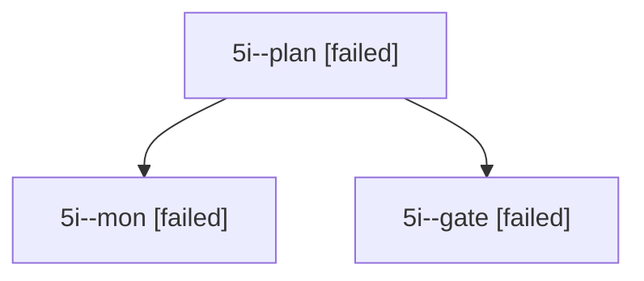

# Session: 5i

[Agent Hoods](../README.md) / [bbugyi200](../users/bbugyi200/README.md) / [apollo](../users/bbugyi200/machines/apollo/README.md) / [5i](../users/bbugyi200/machines/apollo/hoods/5i/README.md) / 5i

Owner: `bbugyi200.apollo` · Hood: `5i` · Members: 3

## Lineage

The diagram is an optional enhancement; the ordered table below contains the same lineage in accessible text.

| Role | Agent | State | Model / provider | Timing | Commits | Prompt | Chat |
|---|---|---|---|---|---:|---|---|
| plan | 5i--plan | failed | opus / claude | 2026-10-07T13:45:49.898923+00:00 → 2026-10-07T13:55:34.831654+00:00 | 0 | [Prompt](../agents/bbugyi200.apollo.5i--plan/prompt.md) | [Chat](../agents/bbugyi200.apollo.5i--plan/chat.md) |
| mon | 5i--mon | failed | opus / claude | 2026-10-07T13:55:28.396508+00:00 → 2026-10-07T13:56:25.205601+00:00 | 0 | — | [Chat](../agents/bbugyi200.apollo.5i--mon/chat.md) |
| gate | 5i--gate | failed | opus / claude | 2026-10-07T13:55:21.394614+00:00 → 2026-10-07T13:55:29.355668+00:00 | 0 | — | [Chat](../agents/bbugyi200.apollo.5i--gate/chat.md) |
