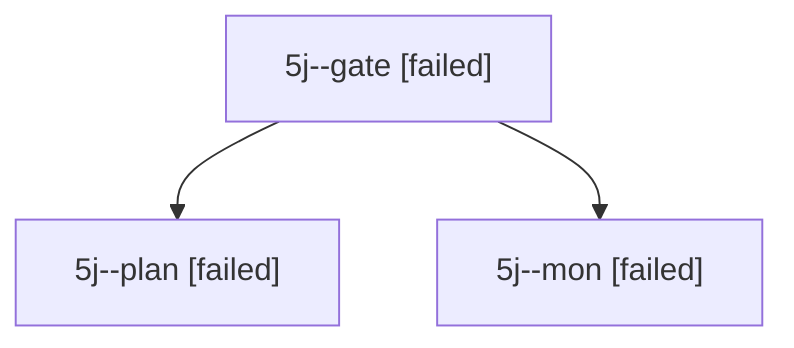

# Session: 5j

[Agent Hoods](../README.md) / [bbugyi200](../users/bbugyi200/README.md) / [apollo](../users/bbugyi200/machines/apollo/README.md) / [5j](../users/bbugyi200/machines/apollo/hoods/5j/README.md) / 5j

Owner: `bbugyi200.apollo` · Hood: `5j` · Members: 3

## Lineage

The diagram is an optional enhancement; the ordered table below contains the same lineage in accessible text.

| Role | Agent | State | Model / provider | Timing | Commits | Prompt | Chat |
|---|---|---|---|---|---:|---|---|
| gate | 5j--gate | failed | opus / claude | 2026-10-07T14:18:14.387747+00:00 → 2026-10-07T14:18:22.365984+00:00 | 0 | — | [Chat](../agents/bbugyi200.apollo.5j--gate/chat.md) |
| plan | 5j--plan | failed | opus / claude | 2026-10-07T13:55:25.480582+00:00 → 2026-10-07T14:18:27.454085+00:00 | 0 | [Prompt](../agents/bbugyi200.apollo.5j--plan/prompt.md) | [Chat](../agents/bbugyi200.apollo.5j--plan/chat.md) |
| mon | 5j--mon | failed | opus / claude | 2026-10-07T14:18:21.631820+00:00 → 2026-10-07T14:19:18.953769+00:00 | 0 | — | [Chat](../agents/bbugyi200.apollo.5j--mon/chat.md) |

## Commits

| Role | Repo | Commit | Subject | Committed |
|---|---|---|---|---|
| — | bob-cli | [`2851360`](https://github.com/bobs-org/bob-cli/commit/28513601ac397c8cfc8608eed59fdf9ce7cbcb6f) | chore: Add Obsidian picker phase beads | 2026-06-11 15:05:26 EDT |
| — | bob-cli | [`9867a51`](https://github.com/bobs-org/bob-cli/commit/9867a51944bfc5e7971b366c847d0a2274f98849) | chore: Sync launched bead database | 2026-06-11 15:07:18 EDT |
