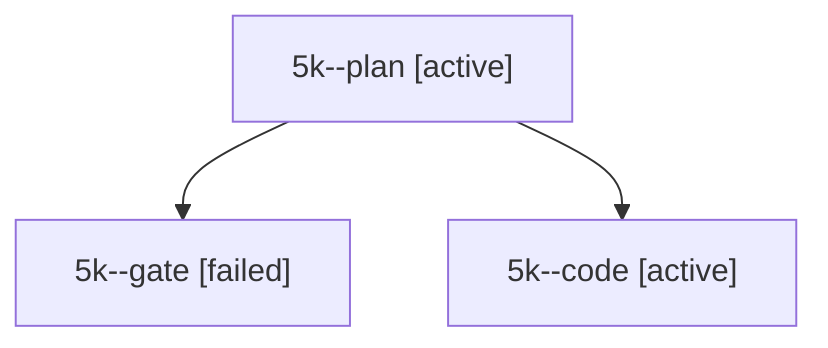

# Session: 5k

[Agent Hoods](../README.md) / [bbugyi200](../users/bbugyi200/README.md) / [apollo](../users/bbugyi200/machines/apollo/README.md) / [5k](../users/bbugyi200/machines/apollo/hoods/5k/README.md) / 5k

Owner: `bbugyi200.apollo` · Hood: `5k` · Members: 3

## Lineage

The diagram is an optional enhancement; the ordered table below contains the same lineage in accessible text.

| Role | Agent | State | Model / provider | Timing | Commits | Prompt | Chat |
|---|---|---|---|---|---:|---|---|
| plan | 5k--plan | active | opus / claude | 2026-10-07T14:28:06.962093+00:00 | 0 | [Prompt](../agents/bbugyi200.apollo.5k--plan/prompt.md) | [Chat](../agents/bbugyi200.apollo.5k--plan/chat.md) |
| gate | 5k--gate | failed | opus / claude | 2026-10-07T14:32:46.826226+00:00 → 2026-10-07T14:32:54.720034+00:00 | 0 | — | [Chat](../agents/bbugyi200.apollo.5k--gate/chat.md) |
| code | 5k--code | active | muse-spark-1.3-contributor / muse | 2026-10-07T14:33:02.370148+00:00 | 0 | — | — |

## Commits

| Role | Repo | Commit | Subject | Committed |
|---|---|---|---|---|
| — | bob-cli | [`27f981a`](https://github.com/bobs-org/bob-cli/commit/27f981ab1779f13b03f20e9b0a5c7b354fa5df13) | chore: Add SDD prompt and plan for obsidian\_projects | 2026-06-11 16:58:10 EDT |
| — | bob-cli | [`d98a32e`](https://github.com/bobs-org/bob-cli/commit/d98a32e709ba690a489953f7b7d58be6bbccc819) | chore: create obsidian projects epic beads | 2026-06-11 17:00:39 EDT |
| — | bob-cli | [`413093b`](https://github.com/bobs-org/bob-cli/commit/413093b700a1345b7f5b5cf20c04d606bd031f7d) | chore: sync bead database after epic kickoff | 2026-06-11 17:02:20 EDT |
