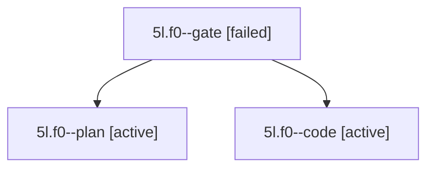

# Session: 5l.f0

[Agent Hoods](../README.md) / [bbugyi200](../users/bbugyi200/README.md) / [apollo](../users/bbugyi200/machines/apollo/README.md) / [5l](../users/bbugyi200/machines/apollo/hoods/5l/README.md) / 5l.f0

Owner: `bbugyi200.apollo` · Hood: `5l` · Members: 3

## Lineage

The diagram is an optional enhancement; the ordered table below contains the same lineage in accessible text.

| Role | Agent | State | Model / provider | Timing | Commits | Prompt | Chat |
|---|---|---|---|---|---:|---|---|
| gate | 5l.f0--gate | failed | opus / claude | 2026-10-07T16:30:25.803865+00:00 → 2026-10-07T16:30:34.840512+00:00 | 0 | — | [Chat](../agents/bbugyi200.apollo.5l.f0--gate/chat.md) |
| plan | 5l.f0--plan | active | opus / claude | 2026-10-07T16:26:07.777508+00:00 | 0 | [Prompt](../agents/bbugyi200.apollo.5l.f0--plan/prompt.md) | [Chat](../agents/bbugyi200.apollo.5l.f0--plan/chat.md) |
| code | 5l.f0--code | active | muse-spark-1.3-contributor / muse | 2026-10-07T16:30:44.005642+00:00 | 0 | — | — |

## Neighbors

| Agent | Relation | State |
|---|---|---|
| [5l](bbugyi200.apollo.5l.md) (session · 5) | ancestor | completed 3, failed 2 |
