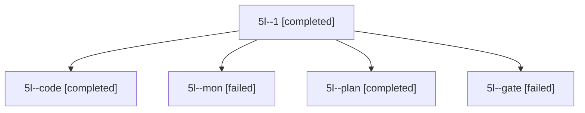

# Session: 5l

[Agent Hoods](../README.md) / [bbugyi200](../users/bbugyi200/README.md) / [apollo](../users/bbugyi200/machines/apollo/README.md) / [5l](../users/bbugyi200/machines/apollo/hoods/5l/README.md) / 5l

Owner: `bbugyi200.apollo` · Hood: `5l` · Members: 5

## Lineage

The diagram is an optional enhancement; the ordered table below contains the same lineage in accessible text.

| Role | Agent | State | Model / provider | Timing | Commits | Prompt | Chat |
|---|---|---|---|---|---:|---|---|
| 1 | 5l--1 | completed | muse-spark-1.3-contributor / muse | 2026-10-07T16:21:21.037303+00:00 → 2026-10-07T16:26:01.863366+00:00 | 0 | [Prompt](../agents/bbugyi200.apollo.5l--1/prompt.md) | [Chat](../agents/bbugyi200.apollo.5l--1/chat.md) |
| code | 5l--code | completed | muse-spark-1.3-contributor / muse | 2026-10-07T16:08:50.259835+00:00 → 2026-10-07T16:20:43.411338+00:00 | 0 | — | [Chat](../agents/bbugyi200.apollo.5l--code/chat.md) |
| mon | 5l--mon | failed | muse-spark-1.3-contributor / muse | 2026-10-07T16:20:17.223059+00:00 → 2026-10-07T16:21:21.237520+00:00 | 0 | — | [Chat](../agents/bbugyi200.apollo.5l--mon/chat.md) |
| plan | 5l--plan | completed | opus / claude | 2026-10-07T15:59:59.497702+00:00 → 2026-10-07T16:20:43.411338+00:00 | 0 | [Prompt](../agents/bbugyi200.apollo.5l--plan/prompt.md) | [Chat](../agents/bbugyi200.apollo.5l--plan/chat.md) |
| gate | 5l--gate | failed | opus / claude | 2026-10-07T16:08:33.801374+00:00 → 2026-10-07T16:08:42.277050+00:00 | 0 | — | [Chat](../agents/bbugyi200.apollo.5l--gate/chat.md) |

## Neighbors

| Agent | Relation | State |
|---|---|---|
| [5l.f0](bbugyi200.apollo.5l.f0.md) (session · 3) | descendant | active 2, failed 1 |
