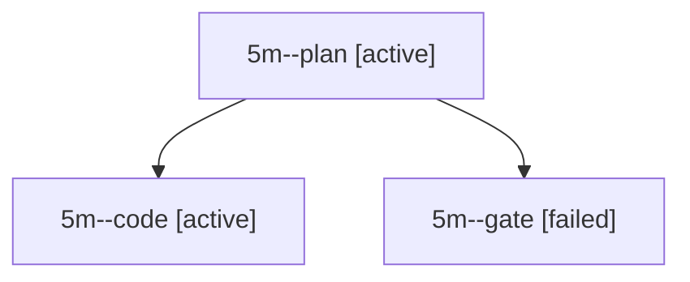

# Session: 5m

[Agent Hoods](../README.md) / [bbugyi200](../users/bbugyi200/README.md) / [apollo](../users/bbugyi200/machines/apollo/README.md) / [5m](../users/bbugyi200/machines/apollo/hoods/5m/README.md) / 5m

Owner: `bbugyi200.apollo` · Hood: `5m` · Members: 3

## Lineage

The diagram is an optional enhancement; the ordered table below contains the same lineage in accessible text.

| Role | Agent | State | Model / provider | Timing | Commits | Prompt | Chat |
|---|---|---|---|---|---:|---|---|
| plan | 5m--plan | active | opus / claude | 2026-10-07T19:15:07.297707+00:00 | 0 | [Prompt](../agents/bbugyi200.apollo.5m--plan/prompt.md) | [Chat](../agents/bbugyi200.apollo.5m--plan/chat.md) |
| code | 5m--code | active | muse-spark-1.3-contributor / muse | 2026-10-07T19:28:09.799680+00:00 | [1](../agents/bbugyi200.apollo.5m--code/README.md#commits) | — | — |
| gate | 5m--gate | failed | opus / claude | 2026-10-07T19:27:52.269872+00:00 → 2026-10-07T19:28:01.360771+00:00 | 0 | — | [Chat](../agents/bbugyi200.apollo.5m--gate/chat.md) |

## Commits

| Role | Repo | Commit | Subject | Committed |
|---|---|---|---|---|
| — | bob-cli | [`6ff5ab3`](https://github.com/bobs-org/bob-cli/commit/6ff5ab36ab2ca78ede4a1485a2356b3bf3868392) | chore: Add SDD prompt and plan for obsidian\_header\_jump\_zt\_scroll | 2026-06-12 07:55:11 EDT |
| code | bob-cli | [`d08df0e`](https://github.com/bobs-org/bob-cli/commit/d08df0ebbdbd02c05c14661289fa956c56fcf69b) | fix(install): restart hint names the menu-bar icon, not the \`Bob\` title | 2026-10-07 15:42:12 EDT |
