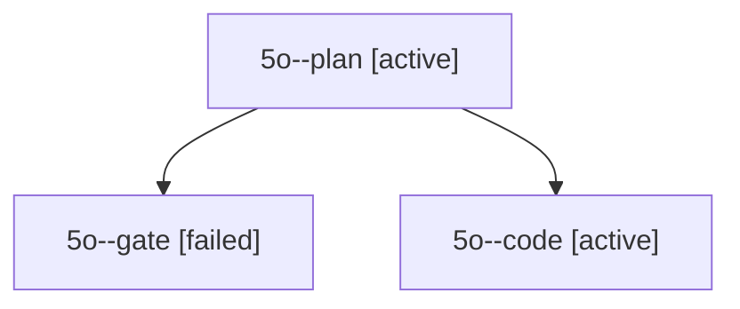

# Session: 5o

[Agent Hoods](../README.md) / [bbugyi200](../users/bbugyi200/README.md) / [apollo](../users/bbugyi200/machines/apollo/README.md) / [5o](../users/bbugyi200/machines/apollo/hoods/5o/README.md) / 5o

Owner: `bbugyi200.apollo` · Hood: `5o` · Members: 3

## Lineage

The diagram is an optional enhancement; the ordered table below contains the same lineage in accessible text.

| Role | Agent | State | Model / provider | Timing | Commits | Prompt | Chat |
|---|---|---|---|---|---:|---|---|
| plan | 5o--plan | active | opus / claude | 2026-10-07T21:51:24.044394+00:00 | 0 | [Prompt](../agents/bbugyi200.apollo.5o--plan/prompt.md) | [Chat](../agents/bbugyi200.apollo.5o--plan/chat.md) |
| gate | 5o--gate | failed | opus / claude | 2026-10-07T22:00:22.995177+00:00 → 2026-10-07T22:00:37.088659+00:00 | 0 | — | [Chat](../agents/bbugyi200.apollo.5o--gate/chat.md) |
| code | 5o--code | active | muse-spark-1.3-contributor / muse | 2026-10-07T22:00:51.343618+00:00 | [1](../agents/bbugyi200.apollo.5o--code/README.md#commits) | — | — |

## Commits

| Role | Repo | Commit | Subject | Committed |
|---|---|---|---|---|
| — | bob-cli | [`70edf9a`](https://github.com/bobs-org/bob-cli/commit/70edf9a919bb9194b82b606d4172e1082b7eec5c) | chore: Add SDD prompt and plan for obsidian\_project\_from\_task\_keymap | 2026-06-12 09:54:16 EDT |
| code | bob-cli | [`73f9cc4`](https://github.com/bobs-org/bob-cli/commit/73f9cc40b74d3af942482ac4e4615ebe5e2979e9) | feat(ref): declare and check Markdown render LaTeX packages | 2026-10-07 18:16:42 EDT |

## Neighbors

| Agent | Relation | State |
|---|---|---|
| [5o.f1](../agents/bbugyi200.apollo.5o.f1/README.md) | descendant | completed |
