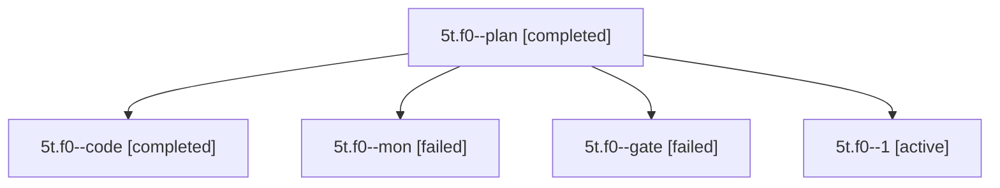

# Session: 5t.f0

[Agent Hoods](../README.md) / [bbugyi200](../users/bbugyi200/README.md) / [apollo](../users/bbugyi200/machines/apollo/README.md) / [5t](../users/bbugyi200/machines/apollo/hoods/5t/README.md) / 5t.f0

Owner: `bbugyi200.apollo` · Hood: `5t` · Members: 5

## Lineage

The diagram is an optional enhancement; the ordered table below contains the same lineage in accessible text.

| Role | Agent | State | Model / provider | Timing | Commits | Prompt | Chat |
|---|---|---|---|---|---:|---|---|
| plan | 5t.f0--plan | completed | opus / claude | 2026-10-08T11:54:30.472274+00:00 → 2026-10-08T12:10:36.970006+00:00 | 0 | [Prompt](../agents/bbugyi200.apollo.5t.f0--plan/prompt.md) | [Chat](../agents/bbugyi200.apollo.5t.f0--plan/chat.md) |
| code | 5t.f0--code | completed | muse-spark-1.3-contributor / muse | 2026-10-08T12:03:28.110030+00:00 → 2026-10-08T12:10:36.970006+00:00 | 0 | — | [Chat](../agents/bbugyi200.apollo.5t.f0--code/chat.md) |
| mon | 5t.f0--mon | failed | muse-spark-1.3-contributor / muse | 2026-10-08T12:09:48.385240+00:00 → 2026-10-08T12:14:28.656579+00:00 | 0 | — | [Chat](../agents/bbugyi200.apollo.5t.f0--mon/chat.md) |
| gate | 5t.f0--gate | failed | opus / claude | 2026-10-08T12:03:01.610442+00:00 → 2026-10-08T12:03:14.711266+00:00 | 0 | — | [Chat](../agents/bbugyi200.apollo.5t.f0--gate/chat.md) |
| 1 | 5t.f0--1 | active | muse-spark-1.3-contributor / muse | 2026-10-08T12:14:28.166675+00:00 | [1](../agents/bbugyi200.apollo.5t.f0--1/README.md#commits) | [Prompt](../agents/bbugyi200.apollo.5t.f0--1/prompt.md) | — |

## Commits

| Role | Repo | Commit | Subject | Committed |
|---|---|---|---|---|
| 1 | bob-cli | [`c861969`](https://github.com/bobs-org/bob-cli/commit/c861969207c70f34279c5d4af7cb2cd235f9f88f) | docs(task-tag-marks): use teal identity ink for #task hash glyph | 2026-10-08 08:17:59 EDT |

## Neighbors

| Agent | Relation | State |
|---|---|---|
| [5t](../agents/bbugyi200.apollo.5t/README.md) | ancestor | completed |
| [5t.f1](../agents/bbugyi200.apollo.5t.f1/README.md) | 5t hood | completed |
