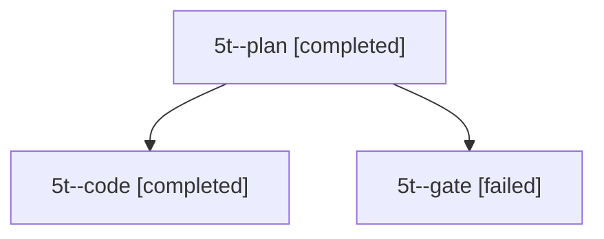

# Session: 5t

[Agent Hoods](../README.md) / [bbugyi200](../users/bbugyi200/README.md) / [apollo](../users/bbugyi200/machines/apollo/README.md) / [5t](../users/bbugyi200/machines/apollo/hoods/5t/README.md) / 5t

Owner: `bbugyi200.apollo` · Hood: `5t` · Members: 3

## Lineage

The diagram is an optional enhancement; the ordered table below contains the same lineage in accessible text.

| Role | Agent | State | Model / provider | Timing | Commits | Prompt | Chat |
|---|---|---|---|---|---:|---|---|
| plan | 5t--plan | completed | opus / claude | 2026-10-08T10:55:40.842488+00:00 → 2026-10-08T11:28:25.619565+00:00 | 0 | [Prompt](../agents/bbugyi200.apollo.5t--plan/prompt.md) | [Chat](../agents/bbugyi200.apollo.5t--plan/chat.md) |
| code | 5t--code | completed | muse-spark-1.3-contributor / muse | 2026-10-08T11:11:54.948386+00:00 → 2026-10-08T11:28:25.619565+00:00 | [1](../agents/bbugyi200.apollo.5t--code/README.md#commits) | — | [Chat](../agents/bbugyi200.apollo.5t--code/chat.md) |
| gate | 5t--gate | failed | opus / claude | 2026-10-08T11:11:39.482377+00:00 → 2026-10-08T11:11:49.128814+00:00 | 0 | — | [Chat](../agents/bbugyi200.apollo.5t--gate/chat.md) |

## Commits

| Role | Repo | Commit | Subject | Committed |
|---|---|---|---|---|
| — | bob-cli | [`abef836`](https://github.com/bobs-org/bob-cli/commit/abef8361b969f53daaf19830b71abb80d2fd30f5) | chore: Add SDD prompt and plan for obsidian\_backslash\_pipe\_dash\_tasks | 2026-06-12 12:46:14 EDT |
| code | bob-cli | [`a869461`](https://github.com/bobs-org/bob-cli/commit/a8694613be69748eb37c2f37b5be34be7b8c374b) | docs(task-tag-marks): add authoritative contract with verbatim vectors and live-verification checklist | 2026-10-08 07:26:10 EDT |

## Neighbors

| Agent | Relation | State |
|---|---|---|
| [5t.f0](bbugyi200.apollo.5t.f0.md) (session · 5) | descendant | active 1, completed 2, failed 2 |
| [5t.f1](../agents/bbugyi200.apollo.5t.f1/README.md) | descendant | completed |
