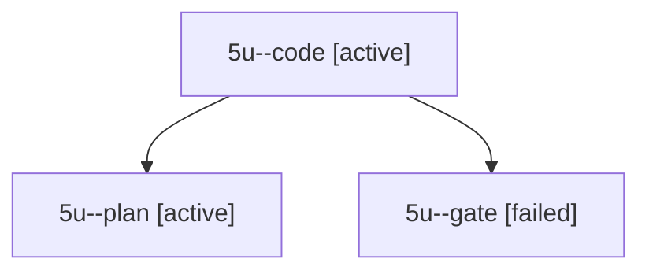

# Session: 5u

[Agent Hoods](../README.md) / [bbugyi200](../users/bbugyi200/README.md) / [apollo](../users/bbugyi200/machines/apollo/README.md) / [5u](../users/bbugyi200/machines/apollo/hoods/5u/README.md) / 5u

Owner: `bbugyi200.apollo` · Hood: `5u` · Members: 3

## Lineage

The diagram is an optional enhancement; the ordered table below contains the same lineage in accessible text.

| Role | Agent | State | Model / provider | Timing | Commits | Prompt | Chat |
|---|---|---|---|---|---:|---|---|
| code | 5u--code | active | muse-spark-1.3-contributor / muse | 2026-10-08T11:20:07.513893+00:00 | 0 | — | — |
| plan | 5u--plan | active | opus / claude | 2026-10-08T11:07:56.155366+00:00 | 0 | [Prompt](../agents/bbugyi200.apollo.5u--plan/prompt.md) | [Chat](../agents/bbugyi200.apollo.5u--plan/chat.md) |
| gate | 5u--gate | failed | opus / claude | 2026-10-08T11:19:46.810996+00:00 → 2026-10-08T11:19:58.566880+00:00 | 0 | — | [Chat](../agents/bbugyi200.apollo.5u--gate/chat.md) |
