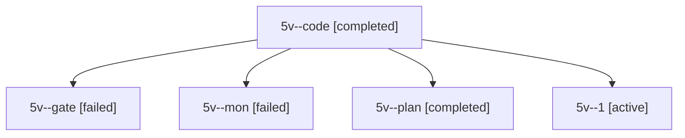

# Session: 5v

[Agent Hoods](../README.md) / [bbugyi200](../users/bbugyi200/README.md) / [apollo](../users/bbugyi200/machines/apollo/README.md) / [5v](../users/bbugyi200/machines/apollo/hoods/5v/README.md) / 5v

Owner: `bbugyi200.apollo` · Hood: `5v` · Members: 5

## Lineage

The diagram is an optional enhancement; the ordered table below contains the same lineage in accessible text.

| Role | Agent | State | Model / provider | Timing | Commits | Prompt | Chat |
|---|---|---|---|---|---:|---|---|
| code | 5v--code | completed | muse-spark-1.3-contributor / muse | 2026-10-08T11:21:44.124844+00:00 → 2026-10-08T11:34:51.196309+00:00 | 0 | — | [Chat](../agents/bbugyi200.apollo.5v--code/chat.md) |
| gate | 5v--gate | failed | opus / claude | 2026-10-08T11:21:21.402676+00:00 → 2026-10-08T11:21:34.312135+00:00 | 0 | — | [Chat](../agents/bbugyi200.apollo.5v--gate/chat.md) |
| mon | 5v--mon | failed | muse-spark-1.3-contributor / muse | 2026-10-08T11:33:58.306985+00:00 → 2026-10-08T11:42:30.223293+00:00 | 0 | — | [Chat](../agents/bbugyi200.apollo.5v--mon/chat.md) |
| plan | 5v--plan | completed | opus / claude | 2026-10-08T11:11:57.277390+00:00 → 2026-10-08T11:34:51.196309+00:00 | 0 | [Prompt](../agents/bbugyi200.apollo.5v--plan/prompt.md) | [Chat](../agents/bbugyi200.apollo.5v--plan/chat.md) |
| 1 | 5v--1 | active | muse-spark-1.3-contributor / muse | 2026-10-08T11:42:29.739219+00:00 | [1](../agents/bbugyi200.apollo.5v--1/README.md#commits) | [Prompt](../agents/bbugyi200.apollo.5v--1/prompt.md) | — |

## Commits

| Role | Repo | Commit | Subject | Committed |
|---|---|---|---|---|
| 1 | bob-cli | [`7b39522`](https://github.com/bobs-org/bob-cli/commit/7b39522a18faf6c5942a14f8c3917e2b2499bda4) | docs(freshness): document \]s/\[s return to current review task first | 2026-10-08 07:47:49 EDT |
