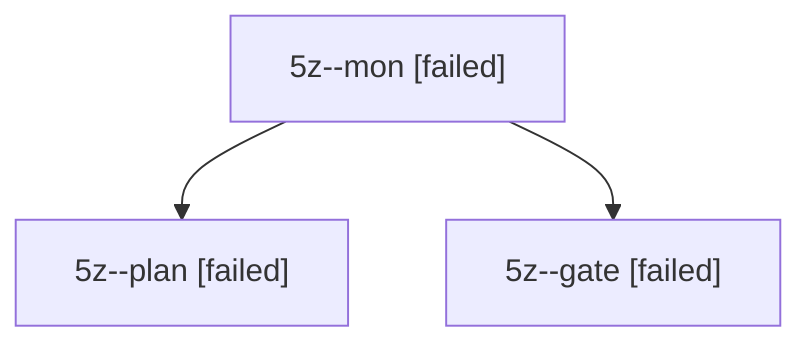

# Session: 5z

[Agent Hoods](../README.md) / [bbugyi200](../users/bbugyi200/README.md) / [apollo](../users/bbugyi200/machines/apollo/README.md) / [5z](../users/bbugyi200/machines/apollo/hoods/5z/README.md) / 5z

Owner: `bbugyi200.apollo` · Hood: `5z` · Members: 3

## Lineage

The diagram is an optional enhancement; the ordered table below contains the same lineage in accessible text.

| Role | Agent | State | Model / provider | Timing | Commits | Prompt | Chat |
|---|---|---|---|---|---:|---|---|
| mon | 5z--mon | failed | opus / claude | 2026-10-08T23:32:33.338241+00:00 → 2026-10-08T23:33:32.487285+00:00 | 0 | — | [Chat](../agents/bbugyi200.apollo.5z--mon/chat.md) |
| plan | 5z--plan | failed | opus / claude | 2026-10-08T23:06:11.931181+00:00 → 2026-10-08T23:32:39.697241+00:00 | 0 | [Prompt](../agents/bbugyi200.apollo.5z--plan/prompt.md) | [Chat](../agents/bbugyi200.apollo.5z--plan/chat.md) |
| gate | 5z--gate | failed | opus / claude | 2026-10-08T23:32:23.078384+00:00 → 2026-10-08T23:32:34.117397+00:00 | 0 | — | [Chat](../agents/bbugyi200.apollo.5z--gate/chat.md) |

## Commits

| Role | Repo | Commit | Subject | Committed |
|---|---|---|---|---|
| — | bob-cli | [`2c93125`](https://github.com/bobs-org/bob-cli/commit/2c931256cb69492e1e936cca5656557665c84bea) | chore: Add SDD prompt and plan for obsidian\_move\_tab\_keymaps | 2026-06-12 14:21:25 EDT |
