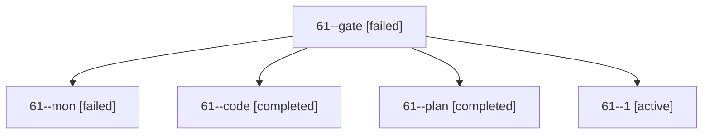

# Session: 61

[Agent Hoods](../README.md) / [bbugyi200](../users/bbugyi200/README.md) / [apollo](../users/bbugyi200/machines/apollo/README.md) / [61](../users/bbugyi200/machines/apollo/hoods/61/README.md) / 61

Owner: `bbugyi200.apollo` · Hood: `61` · Members: 5

## Lineage

The diagram is an optional enhancement; the ordered table below contains the same lineage in accessible text.

| Role | Agent | State | Model / provider | Timing | Commits | Prompt | Chat |
|---|---|---|---|---|---:|---|---|
| gate | 61--gate | failed | gpt-6-astra / codex | 2026-10-09T15:25:14.795838+00:00 → 2026-10-09T15:25:25.137482+00:00 | 0 | — | [Chat](../agents/bbugyi200.apollo.61--gate/chat.md) |
| mon | 61--mon | failed | muse-spark-1.3-contributor / muse | 2026-10-09T16:27:20.611200+00:00 → 2026-10-09T16:30:19.461685+00:00 | 0 | — | [Chat](../agents/bbugyi200.apollo.61--mon/chat.md) |
| code | 61--code | completed | muse-spark-1.3-contributor / muse | 2026-10-09T15:25:34.105884+00:00 → 2026-10-09T16:28:04.297928+00:00 | 0 | — | [Chat](../agents/bbugyi200.apollo.61--code/chat.md) |
| plan | 61--plan | completed | gpt-6-astra / codex | 2026-10-09T15:19:16.752936+00:00 → 2026-10-09T16:28:04.297928+00:00 | 0 | [Prompt](../agents/bbugyi200.apollo.61--plan/prompt.md) | [Chat](../agents/bbugyi200.apollo.61--plan/chat.md) |
| 1 | 61--1 | active | muse-spark-1.3-contributor / muse | 2026-10-09T16:30:19.156925+00:00 | [1](../agents/bbugyi200.apollo.61--1/README.md#commits) | [Prompt](../agents/bbugyi200.apollo.61--1/prompt.md) | — |

## Commits

| Role | Repo | Commit | Subject | Committed |
|---|---|---|---|---|
| — | bob-cli | [`2677dea`](https://github.com/bobs-org/bob-cli/commit/2677dea6c80297ab5ef4f48b1097f1d4542e4ef8) | feat(mark-next): follow transcluded task dependencies | 2026-07-11 16:25:56 EDT |
| 1 | bob-cli | [`db195e3`](https://github.com/bobs-org/bob-cli/commit/db195e3ebb4373d966281aa19b29012d880725b0) | feat(capture): reset note-free Pomodoros with =x0, preserving note-bearing close | 2026-10-09 12:42:34 EDT |

## Neighbors

| Agent | Relation | State |
|---|---|---|
| [61.f-0](../agents/bbugyi200.apollo.61.f-0/README.md) | descendant | completed |
| [61.f-1](../agents/bbugyi200.apollo.61.f-1/README.md) | descendant | completed |
| [61.w0](../agents/bbugyi200.apollo.61.w0/README.md) | descendant | waiting |
| [61.w0.w0](../agents/bbugyi200.apollo.61.w0.w0/README.md) | descendant | waiting |
