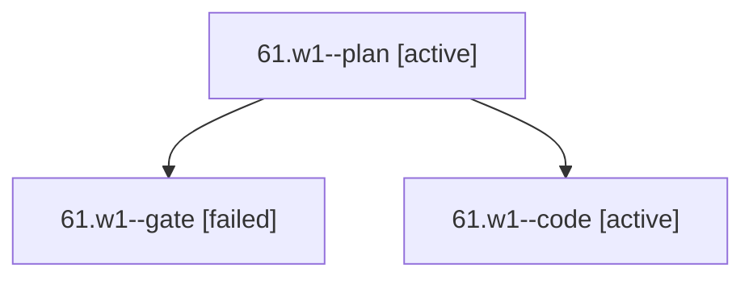

# Session: 61.w1

[Agent Hoods](../README.md) / [bbugyi200](../users/bbugyi200/README.md) / [apollo](../users/bbugyi200/machines/apollo/README.md) / [61](../users/bbugyi200/machines/apollo/hoods/61/README.md) / 61.w1

Owner: `bbugyi200.apollo` · Hood: `61` · Members: 3

## Lineage

The diagram is an optional enhancement; the ordered table below contains the same lineage in accessible text.

| Role | Agent | State | Model / provider | Timing | Commits | Prompt | Chat |
|---|---|---|---|---|---:|---|---|
| plan | 61.w1--plan | active | opus / claude | 2026-10-09T16:49:21.650425+00:00 | 0 | [Prompt](../agents/bbugyi200.apollo.61.w1--plan/prompt.md) | [Chat](../agents/bbugyi200.apollo.61.w1--plan/chat.md) |
| gate | 61.w1--gate | failed | opus / claude | 2026-10-09T17:04:17.693483+00:00 → 2026-10-09T17:04:33.234510+00:00 | 0 | — | [Chat](../agents/bbugyi200.apollo.61.w1--gate/chat.md) |
| code | 61.w1--code | active | muse-spark-1.3-contributor / muse | 2026-10-09T17:04:47.631390+00:00 | 0 | — | — |

## Neighbors

| Agent | Relation | State |
|---|---|---|
| [61](../agents/bbugyi200.apollo.61/README.md) | ancestor | completed |
| [61.w1.w0](../agents/bbugyi200.apollo.61.w1.w0/README.md) | descendant | active |
| [61.f-0](../agents/bbugyi200.apollo.61.f-0/README.md) | 61 hood | completed |
| [61.f-1](../agents/bbugyi200.apollo.61.f-1/README.md) | 61 hood | completed |
| [61.w0](../agents/bbugyi200.apollo.61.w0/README.md) | 61 hood | active |
| [61.w0.w0](../agents/bbugyi200.apollo.61.w0.w0/README.md) | 61 hood | active |
