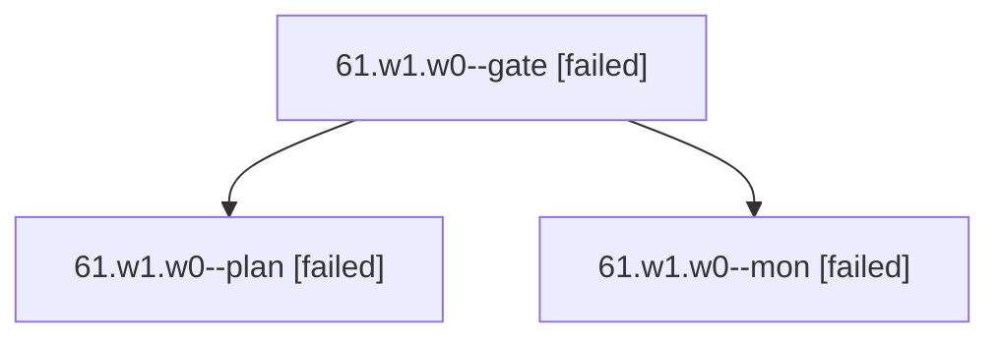

# Session: 61.w1.w0

[Agent Hoods](../README.md) / [bbugyi200](../users/bbugyi200/README.md) / [apollo](../users/bbugyi200/machines/apollo/README.md) / [61](../users/bbugyi200/machines/apollo/hoods/61/README.md) / 61.w1.w0

Owner: `bbugyi200.apollo` · Hood: `61` · Members: 3

## Lineage

The diagram is an optional enhancement; the ordered table below contains the same lineage in accessible text.

| Role | Agent | State | Model / provider | Timing | Commits | Prompt | Chat |
|---|---|---|---|---|---:|---|---|
| gate | 61.w1.w0--gate | failed | opus / claude | 2026-10-09T17:24:29.346850+00:00 → 2026-10-09T17:24:41.029521+00:00 | 0 | — | [Chat](../agents/bbugyi200.apollo.61.w1.w0--gate/chat.md) |
| plan | 61.w1.w0--plan | failed | opus / claude | 2026-10-09T17:05:19.753308+00:00 → 2026-10-09T17:24:47.429405+00:00 | 0 | [Prompt](../agents/bbugyi200.apollo.61.w1.w0--plan/prompt.md) | [Chat](../agents/bbugyi200.apollo.61.w1.w0--plan/chat.md) |
| mon | 61.w1.w0--mon | failed | opus / claude | 2026-10-09T17:24:40.113230+00:00 → 2026-10-09T17:25:59.555087+00:00 | 0 | — | [Chat](../agents/bbugyi200.apollo.61.w1.w0--mon/chat.md) |

## Neighbors

| Agent | Relation | State |
|---|---|---|
| [61.w1](bbugyi200.apollo.61.w1.md) (session · 3) | ancestor | completed 2, failed 1 |
| [61](../agents/bbugyi200.apollo.61/README.md) | ancestor | completed |
| [61.w1.f0](bbugyi200.apollo.61.w1.f0.md) (session · 3) | 61.w1 hood | failed 3 |
| [61.f-0](../agents/bbugyi200.apollo.61.f-0/README.md) | 61 hood | completed |
| [61.f-1](../agents/bbugyi200.apollo.61.f-1/README.md) | 61 hood | completed |
| [61.w0](../agents/bbugyi200.apollo.61.w0/README.md) | 61 hood | active |
| [61.w0.w0](../agents/bbugyi200.apollo.61.w0.w0/README.md) | 61 hood | active |
