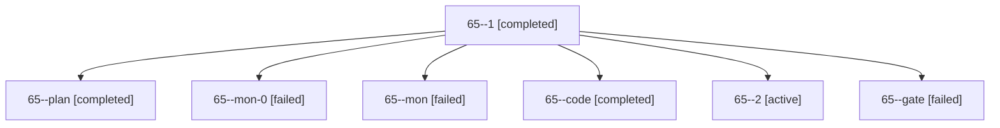

# Session: 65

[Agent Hoods](../README.md) / [bbugyi200](../users/bbugyi200/README.md) / [apollo](../users/bbugyi200/machines/apollo/README.md) / [65](../users/bbugyi200/machines/apollo/hoods/65/README.md) / 65

Owner: `bbugyi200.apollo` · Hood: `65` · Members: 7

## Lineage



The diagram is an optional enhancement; the ordered table below contains the same lineage in accessible text.

| Role | Agent | State | Model / provider | Timing | Commits | Prompt | Chat |
|---|---|---|---|---|---:|---|---|
| <a id="member-1"></a>1 | 65--1 | completed | gpt-6-luna / codex | 2026-10-10T10:49:56.405443+00:00 → 2026-10-10T10:53:30.215202+00:00 | 0 | [Prompt](../agents/bbugyi200.apollo.65--1/prompt.md) | [Chat](../agents/bbugyi200.apollo.65--1/chat.md) |
| <a id="member-plan"></a>plan | 65--plan | completed | gpt-6-astra / codex | 2026-10-10T10:13:43.258797+00:00 → 2026-10-10T10:48:15.019703+00:00 | 0 | [Prompt](../agents/bbugyi200.apollo.65--plan/prompt.md) | [Chat](../agents/bbugyi200.apollo.65--plan/chat.md) |
| <a id="member-mon-0"></a>mon-0 | 65--mon-0 | failed | gpt-6-luna / codex | 2026-10-10T10:52:43.556886+00:00 → 2026-10-10T10:57:40.516984+00:00 | 0 | — | [Chat](../agents/bbugyi200.apollo.65--mon-0/chat.md) |
| <a id="member-mon"></a>mon | 65--mon | failed | gpt-6-luna / codex | 2026-10-10T10:47:21.894923+00:00 → 2026-10-10T10:49:56.448029+00:00 | 0 | — | [Chat](../agents/bbugyi200.apollo.65--mon/chat.md) |
| <a id="member-code"></a>code | 65--code | completed | gpt-6-luna / codex | 2026-10-10T10:21:17.773815+00:00 → 2026-10-10T10:48:15.019703+00:00 | 0 | — | [Chat](../agents/bbugyi200.apollo.65--code/chat.md) |
| <a id="member-2"></a>2 | 65--2 | active | gpt-6-luna / codex | 2026-10-10T10:57:40.152542+00:00 | [1](../agents/bbugyi200.apollo.65--2/README.md#commits) | [Prompt](../agents/bbugyi200.apollo.65--2/prompt.md) | — |
| <a id="member-gate"></a>gate | 65--gate | failed | gpt-6-astra / codex | 2026-10-10T10:20:58.014067+00:00 → 2026-10-10T10:21:08.095056+00:00 | 0 | — | [Chat](../agents/bbugyi200.apollo.65--gate/chat.md) |

## Commits

| Role | Repo | Commit | Subject | Committed |
|---|---|---|---|---|
| 2 | bob-cli | [`8750134`](https://github.com/bobs-org/bob-cli/commit/87501347eb1facd68b0fdf103b683eeb25be1929) | feat(freshness): use ordinary freshness for reference tasks | 2026-10-10 07:02:48 EDT |

## Variables

| Role | Variable | Value |
|---|---|---|
| code | `artifacts` | \[{kind: markdown, label: Approved plan for ordinary reference freshness, path: /home/bryan/.sase/artifacts/agents/gh\_bobs-org\_\_bob-cli/20261010062117/unify\_reference\_task\_freshness-97af34c873fb.md, r… |

#### artifacts

**Role:** `code`

```yaml
- kind: markdown
  label: Approved plan for ordinary reference freshness
  path: /home/bryan/.sase/artifacts/agents/gh_bobs-org__bob-cli/20261010062117/unify_reference_task_freshness-97af34c873fb.md
  ref: file:explicit:021c6821d3325cddb7ab2511
  source_path: /home/bryan/.local/state/sase/workspaces/bobs-org/bob-cli/bob-cli_10/sase/repos/plans/202610/unify_reference_task_freshness.md
```

Values are truncated for display; see each member's agent meta.json for the full values.
