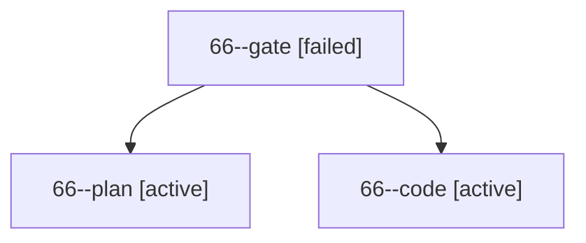

# Session: 66

[Agent Hoods](../README.md) / [bbugyi200](../users/bbugyi200/README.md) / [apollo](../users/bbugyi200/machines/apollo/README.md) / [66](../users/bbugyi200/machines/apollo/hoods/66/README.md) / 66

Owner: `bbugyi200.apollo` · Hood: `66` · Members: 3

## Lineage

The diagram is an optional enhancement; the ordered table below contains the same lineage in accessible text.

| Role | Agent | State | Model / provider | Timing | Commits | Prompt | Chat |
|---|---|---|---|---|---:|---|---|
| gate | 66--gate | failed | gpt-6-astra / codex | 2026-10-10T11:16:13.308505+00:00 → 2026-10-10T11:16:23.143321+00:00 | 0 | — | [Chat](../agents/bbugyi200.apollo.66--gate/chat.md) |
| plan | 66--plan | active | gpt-6-astra / codex | 2026-10-10T11:12:13.183134+00:00 | 0 | [Prompt](../agents/bbugyi200.apollo.66--plan/prompt.md) | [Chat](../agents/bbugyi200.apollo.66--plan/chat.md) |
| code | 66--code | active | grok-4.6 / grok | 2026-10-10T11:16:32.165532+00:00 | 0 | — | — |

## Commits

| Role | Repo | Commit | Subject | Committed |
|---|---|---|---|---|
| — | bob-cli | [`8bcf9cd`](https://github.com/bobs-org/bob-cli/commit/8bcf9cd326dc5eb9123c50ca237a1f894c6fd272) | chore: Add SDD prompt and plan for obsidian\_alt\_t\_duplicate\_tab | 2026-06-13 06:58:56 EDT |
