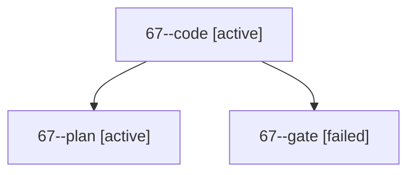

# Session: 67

[Agent Hoods](../README.md) / [bbugyi200](../users/bbugyi200/README.md) / [apollo](../users/bbugyi200/machines/apollo/README.md) / [67](../users/bbugyi200/machines/apollo/hoods/67/README.md) / 67

Owner: `bbugyi200.apollo` · Hood: `67` · Members: 3

## Lineage

The diagram is an optional enhancement; the ordered table below contains the same lineage in accessible text.

| Role | Agent | State | Model / provider | Timing | Commits | Prompt | Chat |
|---|---|---|---|---|---:|---|---|
| code | 67--code | active | muse-spark-1.3-contributor / muse | 2026-10-10T12:26:33.090302+00:00 | [1](../agents/bbugyi200.apollo.67--code/README.md#commits) | — | — |
| plan | 67--plan | active | gpt-6-astra / codex | 2026-10-10T12:20:07.262809+00:00 | 0 | [Prompt](../agents/bbugyi200.apollo.67--plan/prompt.md) | [Chat](../agents/bbugyi200.apollo.67--plan/chat.md) |
| gate | 67--gate | failed | gpt-6-astra / codex | 2026-10-10T12:26:13.280345+00:00 → 2026-10-10T12:26:23.781177+00:00 | 0 | — | [Chat](../agents/bbugyi200.apollo.67--gate/chat.md) |

## Commits

| Role | Repo | Commit | Subject | Committed |
|---|---|---|---|---|
| code | bob-cli | [`e700c21`](https://github.com/bobs-org/bob-cli/commit/e700c21fa7c54af957b981732fc504eafd3854bd) | docs(task-dependencies): name the prompt block-ID prefill policy in 6.5 | 2026-10-10 08:47:30 EDT |
