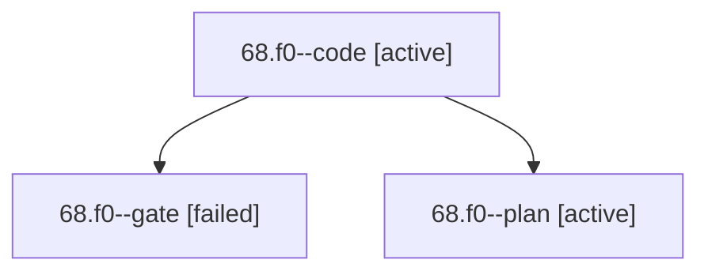

# Session: 68.f0

[Agent Hoods](../README.md) / [bbugyi200](../users/bbugyi200/README.md) / [apollo](../users/bbugyi200/machines/apollo/README.md) / [68](../users/bbugyi200/machines/apollo/hoods/68/README.md) / 68.f0

Owner: `bbugyi200.apollo` · Hood: `68` · Members: 3

## Lineage

The diagram is an optional enhancement; the ordered table below contains the same lineage in accessible text.

| Role | Agent | State | Model / provider | Timing | Commits | Prompt | Chat |
|---|---|---|---|---|---:|---|---|
| code | 68.f0--code | active | grok-4.6 / grok | 2026-10-10T13:41:51.688770+00:00 | [1](../agents/bbugyi200.apollo.68.f0--code/README.md#commits) | — | — |
| gate | 68.f0--gate | failed | gpt-6-astra / codex | 2026-10-10T13:41:23.311295+00:00 → 2026-10-10T13:41:36.650701+00:00 | 0 | — | [Chat](../agents/bbugyi200.apollo.68.f0--gate/chat.md) |
| plan | 68.f0--plan | active | gpt-6-astra / codex | 2026-10-10T13:36:12.383249+00:00 | 0 | [Prompt](../agents/bbugyi200.apollo.68.f0--plan/prompt.md) | [Chat](../agents/bbugyi200.apollo.68.f0--plan/chat.md) |

## Commits

| Role | Repo | Commit | Subject | Committed |
|---|---|---|---|---|
| code | bob-cli | [`b9fb9b8`](https://github.com/bobs-org/bob-cli/commit/b9fb9b8978d5d2c4908a78babea4b482cc1d4b6b) | docs(plan): document daily PENDING/NEXT dashboard section badges | 2026-10-10 10:15:20 EDT |

## Neighbors

| Agent | Relation | State |
|---|---|---|
| [68](bbugyi200.apollo.68.md) (session · 3) | ancestor | completed 2, failed 1 |
