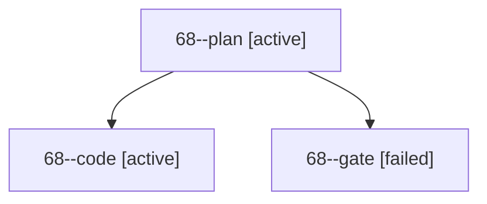

# Session: 68

[Agent Hoods](../README.md) / [bbugyi200](../users/bbugyi200/README.md) / [apollo](../users/bbugyi200/machines/apollo/README.md) / [68](../users/bbugyi200/machines/apollo/hoods/68/README.md) / 68

Owner: `bbugyi200.apollo` · Hood: `68` · Members: 3

## Lineage

The diagram is an optional enhancement; the ordered table below contains the same lineage in accessible text.

| Role | Agent | State | Model / provider | Timing | Commits | Prompt | Chat |
|---|---|---|---|---|---:|---|---|
| plan | 68--plan | active | gpt-6-astra / codex | 2026-10-10T13:00:34.757316+00:00 | 0 | [Prompt](../agents/bbugyi200.apollo.68--plan/prompt.md) | [Chat](../agents/bbugyi200.apollo.68--plan/chat.md) |
| code | 68--code | active | gpt-6-luna / codex | 2026-10-10T13:06:41.669795+00:00 | 0 | — | — |
| gate | 68--gate | failed | gpt-6-astra / codex | 2026-10-10T13:06:21.626977+00:00 → 2026-10-10T13:06:32.195903+00:00 | 0 | — | [Chat](../agents/bbugyi200.apollo.68--gate/chat.md) |
