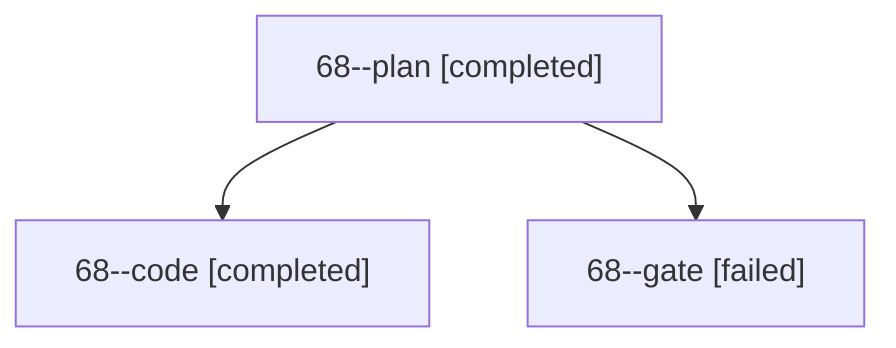

# Session: 68

[Agent Hoods](../README.md) / [bbugyi200](../users/bbugyi200/README.md) / [apollo](../users/bbugyi200/machines/apollo/README.md) / [68](../users/bbugyi200/machines/apollo/hoods/68/README.md) / 68

Owner: `bbugyi200.apollo` · Hood: `68` · Members: 3

## Lineage

The diagram is an optional enhancement; the ordered table below contains the same lineage in accessible text.

| Role | Agent | State | Model / provider | Timing | Commits | Prompt | Chat |
|---|---|---|---|---|---:|---|---|
| plan | 68--plan | completed | gpt-6-astra / codex | 2026-10-10T13:00:34.757316+00:00 → 2026-10-10T13:20:23.785539+00:00 | 0 | [Prompt](../agents/bbugyi200.apollo.68--plan/prompt.md) | [Chat](../agents/bbugyi200.apollo.68--plan/chat.md) |
| code | 68--code | completed | gpt-6-luna / codex | 2026-10-10T13:06:41.669795+00:00 → 2026-10-10T13:20:23.785539+00:00 | [1](../agents/bbugyi200.apollo.68--code/README.md#commits) | — | [Chat](../agents/bbugyi200.apollo.68--code/chat.md) |
| gate | 68--gate | failed | gpt-6-astra / codex | 2026-10-10T13:06:21.626977+00:00 → 2026-10-10T13:06:32.195903+00:00 | 0 | — | [Chat](../agents/bbugyi200.apollo.68--gate/chat.md) |

## Commits

| Role | Repo | Commit | Subject | Committed |
|---|---|---|---|---|
| code | bob-cli | [`5b1e5b5`](https://github.com/bobs-org/bob-cli/commit/5b1e5b5a11bdbe7fe3b3b55748962d15b6792f95) | docs(dashboard): document section warning policy | 2026-10-10 09:18:36 EDT |

## Neighbors

| Agent | Relation | State |
|---|---|---|
| [68.f0](bbugyi200.apollo.68.f0.md) (session · 3) | descendant | active 2, failed 1 |
