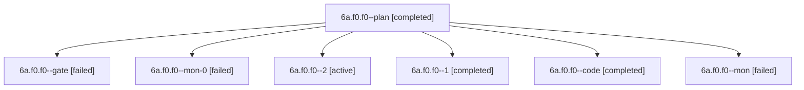

# Session: 6a.f0.f0

[Agent Hoods](../README.md) / [bbugyi200](../users/bbugyi200/README.md) / [apollo](../users/bbugyi200/machines/apollo/README.md) / [6a](../users/bbugyi200/machines/apollo/hoods/6a/README.md) / 6a.f0.f0

Owner: `bbugyi200.apollo` · Hood: `6a` · Members: 7

## Lineage

The diagram is an optional enhancement; the ordered table below contains the same lineage in accessible text.

| Role | Agent | State | Model / provider | Timing | Commits | Prompt | Chat |
|---|---|---|---|---|---:|---|---|
| plan | 6a.f0.f0--plan | completed | gpt-6-astra / codex | 2026-10-10T14:17:35.819987+00:00 → 2026-10-10T15:28:09.734479+00:00 | 0 | [Prompt](../agents/bbugyi200.apollo.6a.f0.f0--plan/prompt.md) | [Chat](../agents/bbugyi200.apollo.6a.f0.f0--plan/chat.md) |
| gate | 6a.f0.f0--gate | failed | gpt-6-astra / codex | 2026-10-10T14:24:16.708489+00:00 → 2026-10-10T14:24:30.032267+00:00 | 0 | — | [Chat](../agents/bbugyi200.apollo.6a.f0.f0--gate/chat.md) |
| mon-0 | 6a.f0.f0--mon-0 | failed | gpt-6-luna / codex | 2026-10-10T15:45:24.628167+00:00 → 2026-10-10T15:48:53.332631+00:00 | 0 | — | [Chat](../agents/bbugyi200.apollo.6a.f0.f0--mon-0/chat.md) |
| 2 | 6a.f0.f0--2 | active | gpt-6-luna / codex | 2026-10-10T15:48:52.817640+00:00 | [1](../agents/bbugyi200.apollo.6a.f0.f0--2/README.md#commits) | [Prompt](../agents/bbugyi200.apollo.6a.f0.f0--2/prompt.md) | — |
| 1 | 6a.f0.f0--1 | completed | gpt-6-luna / codex | 2026-10-10T15:31:54.179492+00:00 → 2026-10-10T15:46:15.237873+00:00 | 0 | [Prompt](../agents/bbugyi200.apollo.6a.f0.f0--1/prompt.md) | [Chat](../agents/bbugyi200.apollo.6a.f0.f0--1/chat.md) |
| code | 6a.f0.f0--code | completed | gpt-6-luna / codex | 2026-10-10T14:24:39.279632+00:00 → 2026-10-10T15:28:09.734479+00:00 | 0 | — | [Chat](../agents/bbugyi200.apollo.6a.f0.f0--code/chat.md) |
| mon | 6a.f0.f0--mon | failed | gpt-6-luna / codex | 2026-10-10T15:27:20.317408+00:00 → 2026-10-10T15:31:54.618680+00:00 | 0 | — | [Chat](../agents/bbugyi200.apollo.6a.f0.f0--mon/chat.md) |

## Commits

| Role | Repo | Commit | Subject | Committed |
|---|---|---|---|---|
| 2 | bob-cli | [`8e6d946`](https://github.com/bobs-org/bob-cli/commit/8e6d946575ec1cbc87358e9320aa51cee8c268ee) | feat(gkeep): add offline open-task migration | 2026-10-10 12:07:39 EDT |

## Neighbors

| Agent | Relation | State |
|---|---|---|
| [6a.f0](bbugyi200.apollo.6a.f0.md) (session · 3) | ancestor | completed 2, failed 1 |
| [6a](bbugyi200.apollo.6a.md) (session · 5) | ancestor | completed 3, failed 2 |
| [6a.f0.f1](bbugyi200.apollo.6a.f0.f1.md) (session · 5) | 6a.f0 hood | completed 3, failed 2 |
