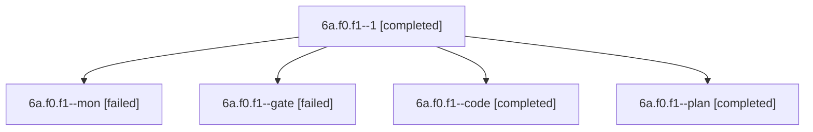

# Session: 6a.f0.f1

[Agent Hoods](../README.md) / [bbugyi200](../users/bbugyi200/README.md) / [apollo](../users/bbugyi200/machines/apollo/README.md) / [6a](../users/bbugyi200/machines/apollo/hoods/6a/README.md) / 6a.f0.f1

Owner: `bbugyi200.apollo` · Hood: `6a` · Members: 5

## Lineage

The diagram is an optional enhancement; the ordered table below contains the same lineage in accessible text.

| Role | Agent | State | Model / provider | Timing | Commits | Prompt | Chat |
|---|---|---|---|---|---:|---|---|
| 1 | 6a.f0.f1--1 | completed | grok-4.6 / grok | 2026-10-10T15:03:57.589675+00:00 → 2026-10-10T15:19:25.570968+00:00 | [1](../agents/bbugyi200.apollo.6a.f0.f1--1/README.md#commits) | [Prompt](../agents/bbugyi200.apollo.6a.f0.f1--1/prompt.md) | [Chat](../agents/bbugyi200.apollo.6a.f0.f1--1/chat.md) |
| mon | 6a.f0.f1--mon | failed | grok-4.6 / grok | 2026-10-10T14:59:34.094818+00:00 → 2026-10-10T15:03:57.715297+00:00 | 0 | — | [Chat](../agents/bbugyi200.apollo.6a.f0.f1--mon/chat.md) |
| gate | 6a.f0.f1--gate | failed | gpt-6-astra / codex | 2026-10-10T14:33:54.855569+00:00 → 2026-10-10T14:34:09.224198+00:00 | 0 | — | [Chat](../agents/bbugyi200.apollo.6a.f0.f1--gate/chat.md) |
| code | 6a.f0.f1--code | completed | grok-4.6 / grok | 2026-10-10T14:34:23.626496+00:00 → 2026-10-10T15:00:26.515023+00:00 | 0 | — | [Chat](../agents/bbugyi200.apollo.6a.f0.f1--code/chat.md) |
| plan | 6a.f0.f1--plan | completed | gpt-6-astra / codex | 2026-10-10T14:27:35.378493+00:00 → 2026-10-10T15:00:26.515023+00:00 | 0 | [Prompt](../agents/bbugyi200.apollo.6a.f0.f1--plan/prompt.md) | [Chat](../agents/bbugyi200.apollo.6a.f0.f1--plan/chat.md) |

## Commits

| Role | Repo | Commit | Subject | Committed |
|---|---|---|---|---|
| 1 | bob-cli | [`c8d0574`](https://github.com/bobs-org/bob-cli/commit/c8d05746ca4612e40b62db1bca0e2227b653d325) | feat(gkeep): track import history through vault Git allowlist | 2026-10-10 11:17:31 EDT |

## Neighbors

| Agent | Relation | State |
|---|---|---|
| [6a.f0](bbugyi200.apollo.6a.f0.md) (session · 3) | ancestor | completed 2, failed 1 |
| [6a](bbugyi200.apollo.6a.md) (session · 5) | ancestor | completed 3, failed 2 |
| [6a.f0.f0](bbugyi200.apollo.6a.f0.f0.md) (session · 7) | 6a.f0 hood | active 1, completed 3, failed 3 |
