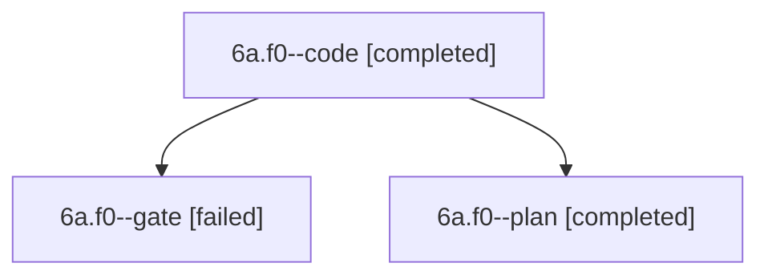

# Session: 6a.f0

[Agent Hoods](../README.md) / [bbugyi200](../users/bbugyi200/README.md) / [apollo](../users/bbugyi200/machines/apollo/README.md) / [6a](../users/bbugyi200/machines/apollo/hoods/6a/README.md) / 6a.f0

Owner: `bbugyi200.apollo` · Hood: `6a` · Members: 3

## Lineage

The diagram is an optional enhancement; the ordered table below contains the same lineage in accessible text.

| Role | Agent | State | Model / provider | Timing | Commits | Prompt | Chat |
|---|---|---|---|---|---:|---|---|
| code | 6a.f0--code | completed | muse-spark-1.3-contributor / muse | 2026-10-10T13:52:38.633231+00:00 → 2026-10-10T14:17:54.954201+00:00 | [1](../agents/bbugyi200.apollo.6a.f0--code/README.md#commits) | — | [Chat](../agents/bbugyi200.apollo.6a.f0--code/chat.md) |
| gate | 6a.f0--gate | failed | gpt-6-astra / codex | 2026-10-10T13:52:14.871389+00:00 → 2026-10-10T13:52:25.870001+00:00 | 0 | — | [Chat](../agents/bbugyi200.apollo.6a.f0--gate/chat.md) |
| plan | 6a.f0--plan | completed | gpt-6-astra / codex | 2026-10-10T13:46:37.194229+00:00 → 2026-10-10T14:17:54.954201+00:00 | 0 | [Prompt](../agents/bbugyi200.apollo.6a.f0--plan/prompt.md) | [Chat](../agents/bbugyi200.apollo.6a.f0--plan/chat.md) |

## Commits

| Role | Repo | Commit | Subject | Committed |
|---|---|---|---|---|
| code | bob-cli | [`bc303b1`](https://github.com/bobs-org/bob-cli/commit/bc303b14239fa43cb07b2d1f2cf41a00dbfadde8) | feat(gkeep): emit marker-free tasks with vault import history and offline migration | 2026-10-10 10:16:31 EDT |

## Neighbors

| Agent | Relation | State |
|---|---|---|
| [6a](bbugyi200.apollo.6a.md) (session · 5) | ancestor | completed 3, failed 2 |
| [6a.f0.f0](bbugyi200.apollo.6a.f0.f0.md) (session · 7) | descendant | active 1, completed 3, failed 3 |
| [6a.f0.f1](bbugyi200.apollo.6a.f0.f1.md) (session · 5) | descendant | completed 3, failed 2 |
