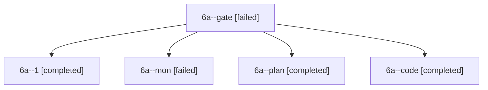

# Session: 6a

[Agent Hoods](../README.md) / [bbugyi200](../users/bbugyi200/README.md) / [apollo](../users/bbugyi200/machines/apollo/README.md) / [6a](../users/bbugyi200/machines/apollo/hoods/6a/README.md) / 6a

Owner: `bbugyi200.apollo` · Hood: `6a` · Members: 5

## Lineage

The diagram is an optional enhancement; the ordered table below contains the same lineage in accessible text.

| Role | Agent | State | Model / provider | Timing | Commits | Prompt | Chat |
|---|---|---|---|---|---:|---|---|
| gate | 6a--gate | failed | gpt-6-astra / codex | 2026-10-10T13:24:11.582556+00:00 → 2026-10-10T13:24:32.623769+00:00 | 0 | — | [Chat](../agents/bbugyi200.apollo.6a--gate/chat.md) |
| 1 | 6a--1 | completed | gpt-6-luna / codex | 2026-10-10T13:36:54.893802+00:00 → 2026-10-10T13:41:53.161628+00:00 | [1](../agents/bbugyi200.apollo.6a--1/README.md#commits) | [Prompt](../agents/bbugyi200.apollo.6a--1/prompt.md) | [Chat](../agents/bbugyi200.apollo.6a--1/chat.md) |
| mon | 6a--mon | failed | gpt-6-luna / codex | 2026-10-10T13:32:44.861188+00:00 → 2026-10-10T13:36:55.372240+00:00 | 0 | — | [Chat](../agents/bbugyi200.apollo.6a--mon/chat.md) |
| plan | 6a--plan | completed | gpt-6-astra / codex | 2026-10-10T13:18:06.351238+00:00 → 2026-10-10T13:33:34.883290+00:00 | 0 | [Prompt](../agents/bbugyi200.apollo.6a--plan/prompt.md) | [Chat](../agents/bbugyi200.apollo.6a--plan/chat.md) |
| code | 6a--code | completed | gpt-6-luna / codex | 2026-10-10T13:24:43.904946+00:00 → 2026-10-10T13:33:34.883290+00:00 | 0 | — | [Chat](../agents/bbugyi200.apollo.6a--code/chat.md) |

## Commits

| Role | Repo | Commit | Subject | Committed |
|---|---|---|---|---|
| 1 | bob-cli | [`38908de`](https://github.com/bobs-org/bob-cli/commit/38908de53e184bd01fb8ccfd6b701daf65f042ea) | feat(gkeep): render marked source icons | 2026-10-10 09:40:29 EDT |

## Neighbors

| Agent | Relation | State |
|---|---|---|
| [6a.f0](bbugyi200.apollo.6a.f0.md) (session · 3) | descendant | active 2, failed 1 |
| [6a.f0.f0](../agents/bbugyi200.apollo.6a.f0.f0/README.md) | descendant | waiting |
