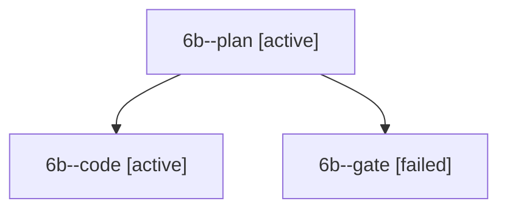

# Session: 6b

[Agent Hoods](../README.md) / [bbugyi200](../users/bbugyi200/README.md) / [apollo](../users/bbugyi200/machines/apollo/README.md) / [6b](../users/bbugyi200/machines/apollo/hoods/6b/README.md) / 6b

Owner: `bbugyi200.apollo` · Hood: `6b` · Members: 3

## Lineage

The diagram is an optional enhancement; the ordered table below contains the same lineage in accessible text.

| Role | Agent | State | Model / provider | Timing | Commits | Prompt | Chat |
|---|---|---|---|---|---:|---|---|
| plan | 6b--plan | active | gpt-6-astra / codex | 2026-10-10T13:40:18.268624+00:00 | 0 | [Prompt](../agents/bbugyi200.apollo.6b--plan/prompt.md) | [Chat](../agents/bbugyi200.apollo.6b--plan/chat.md) |
| code | 6b--code | active | grok-4.6 / grok | 2026-10-10T13:44:58.680450+00:00 | [1](../agents/bbugyi200.apollo.6b--code/README.md#commits) | — | — |
| gate | 6b--gate | failed | gpt-6-astra / codex | 2026-10-10T13:44:32.484325+00:00 → 2026-10-10T13:44:48.550611+00:00 | 0 | — | [Chat](../agents/bbugyi200.apollo.6b--gate/chat.md) |

## Commits

| Role | Repo | Commit | Subject | Committed |
|---|---|---|---|---|
| — | bob-cli | [`5db0e6a`](https://github.com/bobs-org/bob-cli/commit/5db0e6a0bfe4880d957d3c4b6a581a32e358b499) | fix: address review findings across native workflows | 2026-07-11 19:09:56 EDT |
| code | bob-cli | [`6c1969d`](https://github.com/bobs-org/bob-cli/commit/6c1969de4744ccdf9e4b974bc088d32aecc6e364) | docs(dashboard): move BLOCKED into the Browse row | 2026-10-10 09:53:08 EDT |
