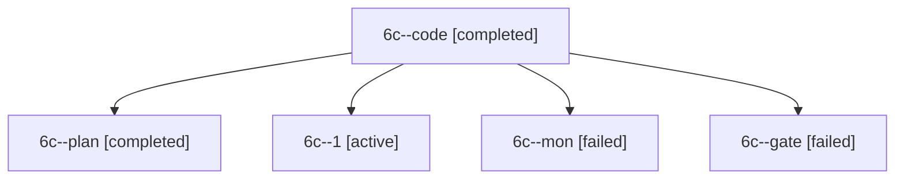

# Session: 6c

[Agent Hoods](../README.md) / [bbugyi200](../users/bbugyi200/README.md) / [apollo](../users/bbugyi200/machines/apollo/README.md) / [6c](../users/bbugyi200/machines/apollo/hoods/6c/README.md) / 6c

Owner: `bbugyi200.apollo` · Hood: `6c` · Members: 5

## Lineage

The diagram is an optional enhancement; the ordered table below contains the same lineage in accessible text.

| Role | Agent | State | Model / provider | Timing | Commits | Prompt | Chat |
|---|---|---|---|---|---:|---|---|
| code | 6c--code | completed | muse-spark-1.3-contributor / muse | 2026-10-10T14:23:50.929928+00:00 → 2026-10-10T14:28:29.199437+00:00 | 0 | — | [Chat](../agents/bbugyi200.apollo.6c--code/chat.md) |
| plan | 6c--plan | completed | gpt-6-astra / codex | 2026-10-10T14:19:07.748990+00:00 → 2026-10-10T14:28:29.199437+00:00 | 0 | [Prompt](../agents/bbugyi200.apollo.6c--plan/prompt.md) | [Chat](../agents/bbugyi200.apollo.6c--plan/chat.md) |
| 1 | 6c--1 | active | muse-spark-1.3-contributor / muse | 2026-10-10T14:33:05.525424+00:00 | [1](../agents/bbugyi200.apollo.6c--1/README.md#commits) | [Prompt](../agents/bbugyi200.apollo.6c--1/prompt.md) | — |
| mon | 6c--mon | failed | muse-spark-1.3-contributor / muse | 2026-10-10T14:27:39.936453+00:00 → 2026-10-10T14:33:05.796118+00:00 | 0 | — | [Chat](../agents/bbugyi200.apollo.6c--mon/chat.md) |
| gate | 6c--gate | failed | gpt-6-astra / codex | 2026-10-10T14:23:26.995877+00:00 → 2026-10-10T14:23:40.121656+00:00 | 0 | — | [Chat](../agents/bbugyi200.apollo.6c--gate/chat.md) |

## Commits

| Role | Repo | Commit | Subject | Committed |
|---|---|---|---|---|
| 1 | bob-cli | [`b0afb10`](https://github.com/bobs-org/bob-cli/commit/b0afb103c862f4a8d051f347d27f8f678f326296) | docs(dashboard): document Review-badge count rule for NEW, ROTTEN, CROWDED | 2026-10-10 10:38:27 EDT |

## Neighbors

| Agent | Relation | State |
|---|---|---|
| [6c.w0](../agents/bbugyi200.apollo.6c.w0/README.md) | descendant | active |
| [6c.w1](../agents/bbugyi200.apollo.6c.w1/README.md) | descendant | waiting |
