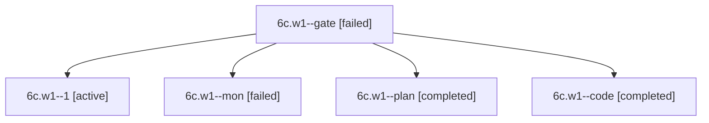

# Session: 6c.w1

[Agent Hoods](../README.md) / [bbugyi200](../users/bbugyi200/README.md) / [apollo](../users/bbugyi200/machines/apollo/README.md) / [6c](../users/bbugyi200/machines/apollo/hoods/6c/README.md) / 6c.w1

Owner: `bbugyi200.apollo` · Hood: `6c` · Members: 5

## Lineage

The diagram is an optional enhancement; the ordered table below contains the same lineage in accessible text.

| Role | Agent | State | Model / provider | Timing | Commits | Prompt | Chat |
|---|---|---|---|---|---:|---|---|
| gate | 6c.w1--gate | failed | gpt-6-astra / codex | 2026-10-10T14:45:13.820334+00:00 → 2026-10-10T14:45:28.674766+00:00 | 0 | — | [Chat](../agents/bbugyi200.apollo.6c.w1--gate/chat.md) |
| 1 | 6c.w1--1 | active | muse-spark-1.3-contributor / muse | 2026-10-10T15:06:44.663768+00:00 | [1](../agents/bbugyi200.apollo.6c.w1--1/README.md#commits) | [Prompt](../agents/bbugyi200.apollo.6c.w1--1/prompt.md) | — |
| mon | 6c.w1--mon | failed | muse-spark-1.3-contributor / muse | 2026-10-10T15:01:07.475884+00:00 → 2026-10-10T15:06:44.887745+00:00 | 0 | — | [Chat](../agents/bbugyi200.apollo.6c.w1--mon/chat.md) |
| plan | 6c.w1--plan | completed | gpt-6-astra / codex | 2026-10-10T14:39:57.954996+00:00 → 2026-10-10T15:01:58.672064+00:00 | 0 | [Prompt](../agents/bbugyi200.apollo.6c.w1--plan/prompt.md) | [Chat](../agents/bbugyi200.apollo.6c.w1--plan/chat.md) |
| code | 6c.w1--code | completed | muse-spark-1.3-contributor / muse | 2026-10-10T14:45:40.704335+00:00 → 2026-10-10T15:01:58.672064+00:00 | 0 | — | [Chat](../agents/bbugyi200.apollo.6c.w1--code/chat.md) |

## Commits

| Role | Repo | Commit | Subject | Committed |
|---|---|---|---|---|
| 1 | bob-cli | [`7bd0577`](https://github.com/bobs-org/bob-cli/commit/7bd057725f825db0ab26655c3c1623ae4265f458) | docs(dashboard): document consistent Work badge color policy | 2026-10-10 11:15:13 EDT |

## Neighbors

| Agent | Relation | State |
|---|---|---|
| [6c](bbugyi200.apollo.6c.md) (session · 5) | ancestor | completed 3, failed 2 |
| [6c.w0](../agents/bbugyi200.apollo.6c.w0/README.md) | 6c hood | active |
