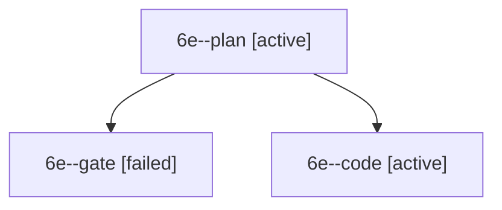

# Session: 6e

[Agent Hoods](../README.md) / [bbugyi200](../users/bbugyi200/README.md) / [apollo](../users/bbugyi200/machines/apollo/README.md) / [6e](../users/bbugyi200/machines/apollo/hoods/6e/README.md) / 6e

Owner: `bbugyi200.apollo` · Hood: `6e` · Members: 3

## Lineage

The diagram is an optional enhancement; the ordered table below contains the same lineage in accessible text.

| Role | Agent | State | Model / provider | Timing | Commits | Prompt | Chat |
|---|---|---|---|---|---:|---|---|
| plan | 6e--plan | active | grok-4.7 / grok | 2026-10-10T16:21:31.164864+00:00 | 0 | [Prompt](../agents/bbugyi200.apollo.6e--plan/prompt.md) | [Chat](../agents/bbugyi200.apollo.6e--plan/chat.md) |
| gate | 6e--gate | failed | grok-4.7 / grok | 2026-10-10T16:33:27.524567+00:00 → 2026-10-10T16:33:42.514434+00:00 | 0 | — | [Chat](../agents/bbugyi200.apollo.6e--gate/chat.md) |
| code | 6e--code | active | grok-4.6 / grok | 2026-10-10T16:33:51.163971+00:00 | [1](../agents/bbugyi200.apollo.6e--code/README.md#commits) | — | — |

## Commits

| Role | Repo | Commit | Subject | Committed |
|---|---|---|---|---|
| code | bob-cli | [`559e45b`](https://github.com/bobs-org/bob-cli/commit/559e45bd6b7dc3c9e17aeb71feaff76485c1f160) | docs(dashboard): put Review above Work in navigation order | 2026-10-10 12:38:20 EDT |
