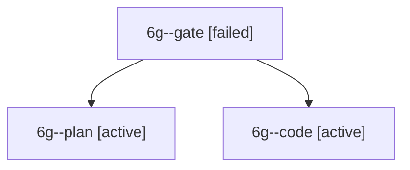

# Session: 6g

[Agent Hoods](../README.md) / [bbugyi200](../users/bbugyi200/README.md) / [apollo](../users/bbugyi200/machines/apollo/README.md) / [6g](../users/bbugyi200/machines/apollo/hoods/6g/README.md) / 6g

Owner: `bbugyi200.apollo` · Hood: `6g` · Members: 3

## Lineage

The diagram is an optional enhancement; the ordered table below contains the same lineage in accessible text.

| Role | Agent | State | Model / provider | Timing | Commits | Prompt | Chat |
|---|---|---|---|---|---:|---|---|
| gate | 6g--gate | failed | gpt-6-astra / codex | 2026-10-10T16:39:51.371495+00:00 → 2026-10-10T16:40:04.509650+00:00 | 0 | — | [Chat](../agents/bbugyi200.apollo.6g--gate/chat.md) |
| plan | 6g--plan | active | gpt-6-astra / codex | 2026-10-10T16:33:48.786034+00:00 | 0 | [Prompt](../agents/bbugyi200.apollo.6g--plan/prompt.md) | [Chat](../agents/bbugyi200.apollo.6g--plan/chat.md) |
| code | 6g--code | active | grok-4.6 / grok | 2026-10-10T16:40:17.174360+00:00 | [1](../agents/bbugyi200.apollo.6g--code/README.md#commits) | — | — |

## Commits

| Role | Repo | Commit | Subject | Committed |
|---|---|---|---|---|
| code | bob-cli | [`44d2ed6`](https://github.com/bobs-org/bob-cli/commit/44d2ed6a235bcb6841383667c96773c3a9a1b8c3) | feat(capture): toggle block-ID separators in capture-rewrite | 2026-10-10 13:29:47 EDT |

## Neighbors

| Agent | Relation | State |
|---|---|---|
| [6g.w0](../agents/bbugyi200.apollo.6g.w0/README.md) | descendant | active |
| [6g.w1](../agents/bbugyi200.apollo.6g.w1/README.md) | descendant | waiting |
| [6g.w1.w0](../agents/bbugyi200.apollo.6g.w1.w0/README.md) | descendant | waiting |
