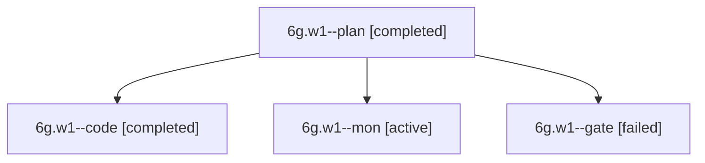

# Session: 6g.w1

[Agent Hoods](../README.md) / [bbugyi200](../users/bbugyi200/README.md) / [apollo](../users/bbugyi200/machines/apollo/README.md) / [6g](../users/bbugyi200/machines/apollo/hoods/6g/README.md) / 6g.w1

Owner: `bbugyi200.apollo` · Hood: `6g` · Members: 4

## Lineage

The diagram is an optional enhancement; the ordered table below contains the same lineage in accessible text.

| Role | Agent | State | Model / provider | Timing | Commits | Prompt | Chat |
|---|---|---|---|---|---:|---|---|
| plan | 6g.w1--plan | completed | gpt-6-astra / codex | 2026-10-10T17:31:16.864983+00:00 → 2026-10-10T17:52:52.772176+00:00 | 0 | [Prompt](../agents/bbugyi200.apollo.6g.w1--plan/prompt.md) | [Chat](../agents/bbugyi200.apollo.6g.w1--plan/chat.md) |
| code | 6g.w1--code | completed | gpt-6-luna / codex | 2026-10-10T17:36:10.046827+00:00 → 2026-10-10T17:52:52.772176+00:00 | 0 | — | [Chat](../agents/bbugyi200.apollo.6g.w1--code/chat.md) |
| mon | 6g.w1--mon | active | gpt-6-luna / codex | 2026-10-10T17:51:46.097876+00:00 | 0 | — | — |
| gate | 6g.w1--gate | failed | gpt-6-astra / codex | 2026-10-10T17:35:41.960247+00:00 → 2026-10-10T17:35:56.860775+00:00 | 0 | — | [Chat](../agents/bbugyi200.apollo.6g.w1--gate/chat.md) |

## Neighbors

| Agent | Relation | State |
|---|---|---|
| [6g](bbugyi200.apollo.6g.md) (session · 3) | ancestor | completed 2, failed 1 |
| [6g.w1.w0](bbugyi200.apollo.6g.w1.w0.md) (session · 3) | descendant | active 2, failed 1 |
| [6g.w0](../agents/bbugyi200.apollo.6g.w0/README.md) | 6g hood | active |
