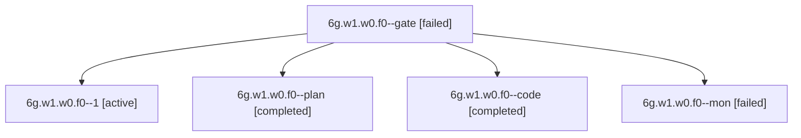

# Session: 6g.w1.w0.f0

[Agent Hoods](../README.md) / [bbugyi200](../users/bbugyi200/README.md) / [apollo](../users/bbugyi200/machines/apollo/README.md) / [6g](../users/bbugyi200/machines/apollo/hoods/6g/README.md) / 6g.w1.w0.f0

Owner: `bbugyi200.apollo` · Hood: `6g` · Members: 5

## Lineage

The diagram is an optional enhancement; the ordered table below contains the same lineage in accessible text.

| Role | Agent | State | Model / provider | Timing | Commits | Prompt | Chat |
|---|---|---|---|---|---:|---|---|
| gate | 6g.w1.w0.f0--gate | failed | gpt-6-astra / codex | 2026-10-10T18:31:46.275639+00:00 → 2026-10-10T18:32:01.157304+00:00 | 0 | — | [Chat](../agents/bbugyi200.apollo.6g.w1.w0.f0--gate/chat.md) |
| 1 | 6g.w1.w0.f0--1 | active | muse-spark-1.3-contributor / muse | 2026-10-10T18:55:19.441634+00:00 | 0 | [Prompt](../agents/bbugyi200.apollo.6g.w1.w0.f0--1/prompt.md) | — |
| plan | 6g.w1.w0.f0--plan | completed | gpt-6-astra / codex | 2026-10-10T18:26:31.265577+00:00 → 2026-10-10T18:50:22.166794+00:00 | 0 | [Prompt](../agents/bbugyi200.apollo.6g.w1.w0.f0--plan/prompt.md) | [Chat](../agents/bbugyi200.apollo.6g.w1.w0.f0--plan/chat.md) |
| code | 6g.w1.w0.f0--code | completed | muse-spark-1.3-contributor / muse | 2026-10-10T18:32:15.768812+00:00 → 2026-10-10T18:50:22.166794+00:00 | 0 | — | [Chat](../agents/bbugyi200.apollo.6g.w1.w0.f0--code/chat.md) |
| mon | 6g.w1.w0.f0--mon | failed | muse-spark-1.3-contributor / muse | 2026-10-10T18:49:32.897855+00:00 → 2026-10-10T18:55:19.616600+00:00 | 0 | — | [Chat](../agents/bbugyi200.apollo.6g.w1.w0.f0--mon/chat.md) |

## Neighbors

| Agent | Relation | State |
|---|---|---|
| [6g.w1.w0](bbugyi200.apollo.6g.w1.w0.md) (session · 3) | ancestor | completed 2, failed 1 |
| [6g.w1](bbugyi200.apollo.6g.w1.md) (session · 7) | ancestor | completed 4, failed 3 |
| [6g](bbugyi200.apollo.6g.md) (session · 3) | ancestor | completed 2, failed 1 |
| [6g.w1.w0.f0.w0](bbugyi200.apollo.6g.w1.w0.f0.w0.md) (session · 3) | descendant | completed 2, failed 1 |
| [6g.w0](../agents/bbugyi200.apollo.6g.w0/README.md) | 6g hood | active |
