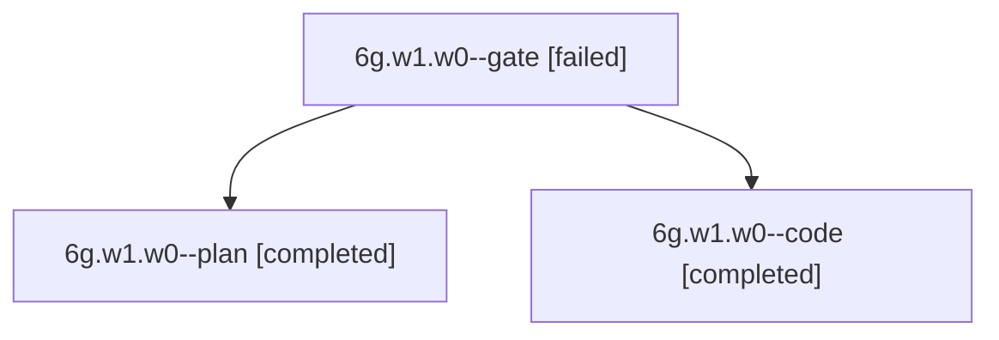

# Session: 6g.w1.w0

[Agent Hoods](../README.md) / [bbugyi200](../users/bbugyi200/README.md) / [apollo](../users/bbugyi200/machines/apollo/README.md) / [6g](../users/bbugyi200/machines/apollo/hoods/6g/README.md) / 6g.w1.w0

Owner: `bbugyi200.apollo` · Hood: `6g` · Members: 3

## Lineage

The diagram is an optional enhancement; the ordered table below contains the same lineage in accessible text.

| Role | Agent | State | Model / provider | Timing | Commits | Prompt | Chat |
|---|---|---|---|---|---:|---|---|
| gate | 6g.w1.w0--gate | failed | gpt-6-astra / codex | 2026-10-10T17:40:05.585368+00:00 → 2026-10-10T17:40:20.861772+00:00 | 0 | — | [Chat](../agents/bbugyi200.apollo.6g.w1.w0--gate/chat.md) |
| plan | 6g.w1.w0--plan | completed | gpt-6-astra / codex | 2026-10-10T17:36:11.773321+00:00 → 2026-10-10T17:54:15.898754+00:00 | 0 | [Prompt](../agents/bbugyi200.apollo.6g.w1.w0--plan/prompt.md) | [Chat](../agents/bbugyi200.apollo.6g.w1.w0--plan/chat.md) |
| code | 6g.w1.w0--code | completed | grok-4.6 / grok | 2026-10-10T17:40:32.753979+00:00 → 2026-10-10T17:54:15.898754+00:00 | 0 | — | [Chat](../agents/bbugyi200.apollo.6g.w1.w0--code/chat.md) |

## Neighbors

| Agent | Relation | State |
|---|---|---|
| [6g.w1](bbugyi200.apollo.6g.w1.md) (session · 7) | ancestor | completed 4, failed 3 |
| [6g](bbugyi200.apollo.6g.md) (session · 3) | ancestor | completed 2, failed 1 |
| [6g.w1.w0.f0](bbugyi200.apollo.6g.w1.w0.f0.md) (session · 3) | descendant | active 2, failed 1 |
| [6g.w1.w0.f0.w0](bbugyi200.apollo.6g.w1.w0.f0.w0.md) (session · 3) | descendant | active 2, failed 1 |
| [6g.w0](../agents/bbugyi200.apollo.6g.w0/README.md) | 6g hood | active |
