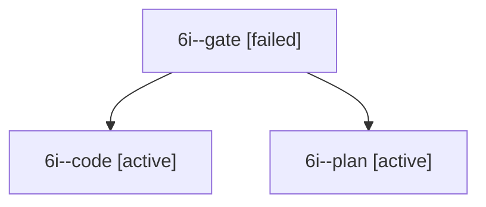

# Session: 6i

[Agent Hoods](../README.md) / [bbugyi200](../users/bbugyi200/README.md) / [apollo](../users/bbugyi200/machines/apollo/README.md) / [6i](../users/bbugyi200/machines/apollo/hoods/6i/README.md) / 6i

Owner: `bbugyi200.apollo` · Hood: `6i` · Members: 3

## Lineage

The diagram is an optional enhancement; the ordered table below contains the same lineage in accessible text.

| Role | Agent | State | Model / provider | Timing | Commits | Prompt | Chat |
|---|---|---|---|---|---:|---|---|
| gate | 6i--gate | failed | grok-4.7 / grok | 2026-10-10T19:13:14.049152+00:00 → 2026-10-10T19:13:28.670711+00:00 | 0 | — | [Chat](../agents/bbugyi200.apollo.6i--gate/chat.md) |
| code | 6i--code | active | gpt-6-luna / codex | 2026-10-10T19:13:40.450304+00:00 | 0 | — | — |
| plan | 6i--plan | active | grok-4.7 / grok | 2026-10-10T18:59:40.586013+00:00 | 0 | [Prompt](../agents/bbugyi200.apollo.6i--plan/prompt.md) | [Chat](../agents/bbugyi200.apollo.6i--plan/chat.md) |

## Commits

| Role | Repo | Commit | Subject | Committed |
|---|---|---|---|---|
| — | bob-cli | [`6e1fd4f`](https://github.com/bobs-org/bob-cli/commit/6e1fd4fe82a022242d35eccfa1ef568b1bab769a) | feat: normalize Pomodoro session markers | 2026-07-12 08:47:34 EDT |

## Neighbors

| Agent | Relation | State |
|---|---|---|
| [6i.f-0](../agents/bbugyi200.apollo.6i.f-0/README.md) | descendant | completed |
