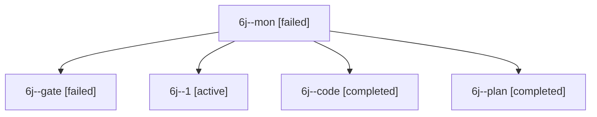

# Session: 6j

[Agent Hoods](../README.md) / [bbugyi200](../users/bbugyi200/README.md) / [apollo](../users/bbugyi200/machines/apollo/README.md) / [6j](../users/bbugyi200/machines/apollo/hoods/6j/README.md) / 6j

Owner: `bbugyi200.apollo` · Hood: `6j` · Members: 5

## Lineage

The diagram is an optional enhancement; the ordered table below contains the same lineage in accessible text.

| Role | Agent | State | Model / provider | Timing | Commits | Prompt | Chat |
|---|---|---|---|---|---:|---|---|
| mon | 6j--mon | failed | muse-spark-1.3-contributor / muse | 2026-10-10T19:23:41.067927+00:00 → 2026-10-10T19:29:20.433046+00:00 | 0 | — | [Chat](../agents/bbugyi200.apollo.6j--mon/chat.md) |
| gate | 6j--gate | failed | gpt-6-astra / codex | 2026-10-10T19:18:45.843205+00:00 → 2026-10-10T19:18:58.537889+00:00 | 0 | — | [Chat](../agents/bbugyi200.apollo.6j--gate/chat.md) |
| 1 | 6j--1 | active | muse-spark-1.3-contributor / muse | 2026-10-10T19:29:20.002522+00:00 | [1](../agents/bbugyi200.apollo.6j--1/README.md#commits) | [Prompt](../agents/bbugyi200.apollo.6j--1/prompt.md) | — |
| code | 6j--code | completed | muse-spark-1.3-contributor / muse | 2026-10-10T19:19:11.244711+00:00 → 2026-10-10T19:24:30.891010+00:00 | 0 | — | [Chat](../agents/bbugyi200.apollo.6j--code/chat.md) |
| plan | 6j--plan | completed | gpt-6-astra / codex | 2026-10-10T19:13:04.489352+00:00 → 2026-10-10T19:24:30.891010+00:00 | 0 | [Prompt](../agents/bbugyi200.apollo.6j--plan/prompt.md) | [Chat](../agents/bbugyi200.apollo.6j--plan/chat.md) |

## Commits

| Role | Repo | Commit | Subject | Committed |
|---|---|---|---|---|
| 1 | bob-cli | [`1870ac1`](https://github.com/bobs-org/bob-cli/commit/1870ac1b249d33c8a8b34369ee91ccd149e24381) | docs(ref): document macOS BasicTeX user-mode needspace recovery | 2026-10-10 15:33:33 EDT |
