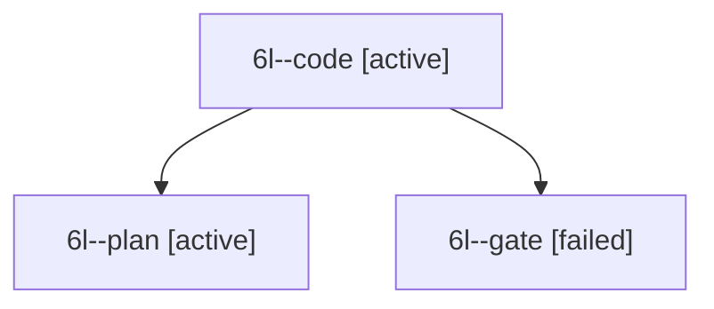

# Session: 6l

[Agent Hoods](../README.md) / [bbugyi200](../users/bbugyi200/README.md) / [apollo](../users/bbugyi200/machines/apollo/README.md) / [6l](../users/bbugyi200/machines/apollo/hoods/6l/README.md) / 6l

Owner: `bbugyi200.apollo` · Hood: `6l` · Members: 3

## Lineage

The diagram is an optional enhancement; the ordered table below contains the same lineage in accessible text.

| Role | Agent | State | Model / provider | Timing | Commits | Prompt | Chat |
|---|---|---|---|---|---:|---|---|
| code | 6l--code | active | muse-spark-1.3-contributor / muse | 2026-10-10T20:07:18.452112+00:00 | 0 | — | — |
| plan | 6l--plan | active | gpt-6-astra / codex | 2026-10-10T20:01:36.318326+00:00 | 0 | [Prompt](../agents/bbugyi200.apollo.6l--plan/prompt.md) | [Chat](../agents/bbugyi200.apollo.6l--plan/chat.md) |
| gate | 6l--gate | failed | gpt-6-astra / codex | 2026-10-10T20:06:51.996005+00:00 → 2026-10-10T20:07:04.999674+00:00 | 0 | — | [Chat](../agents/bbugyi200.apollo.6l--gate/chat.md) |
