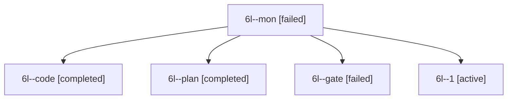

# Session: 6l

[Agent Hoods](../README.md) / [bbugyi200](../users/bbugyi200/README.md) / [apollo](../users/bbugyi200/machines/apollo/README.md) / [6l](../users/bbugyi200/machines/apollo/hoods/6l/README.md) / 6l

Owner: `bbugyi200.apollo` · Hood: `6l` · Members: 5

## Lineage

The diagram is an optional enhancement; the ordered table below contains the same lineage in accessible text.

| Role | Agent | State | Model / provider | Timing | Commits | Prompt | Chat |
|---|---|---|---|---|---:|---|---|
| mon | 6l--mon | failed | muse-spark-1.3-contributor / muse | 2026-10-10T20:50:20.603032+00:00 → 2026-10-10T20:56:59.181552+00:00 | 0 | — | [Chat](../agents/bbugyi200.apollo.6l--mon/chat.md) |
| code | 6l--code | completed | muse-spark-1.3-contributor / muse | 2026-10-10T20:07:18.452112+00:00 → 2026-10-10T20:51:25.101172+00:00 | 0 | — | [Chat](../agents/bbugyi200.apollo.6l--code/chat.md) |
| plan | 6l--plan | completed | gpt-6-astra / codex | 2026-10-10T20:01:36.318326+00:00 → 2026-10-10T20:51:25.101172+00:00 | 0 | [Prompt](../agents/bbugyi200.apollo.6l--plan/prompt.md) | [Chat](../agents/bbugyi200.apollo.6l--plan/chat.md) |
| gate | 6l--gate | failed | gpt-6-astra / codex | 2026-10-10T20:06:51.996005+00:00 → 2026-10-10T20:07:04.999674+00:00 | 0 | — | [Chat](../agents/bbugyi200.apollo.6l--gate/chat.md) |
| 1 | 6l--1 | active | muse-spark-1.3-contributor / muse | 2026-10-10T20:57:03.040535+00:00 | [1](../agents/bbugyi200.apollo.6l--1/README.md#commits) | [Prompt](../agents/bbugyi200.apollo.6l--1/prompt.md) | — |

## Commits

| Role | Repo | Commit | Subject | Committed |
|---|---|---|---|---|
| 1 | bob-cli | [`d1d50a6`](https://github.com/bobs-org/bob-cli/commit/d1d50a6dd75dd501e120084f3b3a7fa92aa3e294) | feat(capture): add URL listen marker @ for companion audio | 2026-10-10 16:58:50 EDT |
