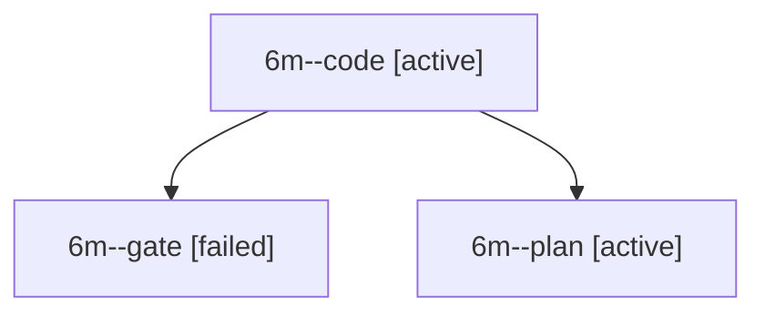

# Session: 6m

[Agent Hoods](../README.md) / [bbugyi200](../users/bbugyi200/README.md) / [apollo](../users/bbugyi200/machines/apollo/README.md) / [6m](../users/bbugyi200/machines/apollo/hoods/6m/README.md) / 6m

Owner: `bbugyi200.apollo` · Hood: `6m` · Members: 3

## Lineage

The diagram is an optional enhancement; the ordered table below contains the same lineage in accessible text.

| Role | Agent | State | Model / provider | Timing | Commits | Prompt | Chat |
|---|---|---|---|---|---:|---|---|
| code | 6m--code | active | grok-4.6 / grok | 2026-10-10T20:11:04.232700+00:00 | [1](../agents/bbugyi200.apollo.6m--code/README.md#commits) | — | — |
| gate | 6m--gate | failed | gpt-6-astra / codex | 2026-10-10T20:10:40.465318+00:00 → 2026-10-10T20:10:53.529997+00:00 | 0 | — | [Chat](../agents/bbugyi200.apollo.6m--gate/chat.md) |
| plan | 6m--plan | active | gpt-6-astra / codex | 2026-10-10T20:05:53.789688+00:00 | 0 | [Prompt](../agents/bbugyi200.apollo.6m--plan/prompt.md) | [Chat](../agents/bbugyi200.apollo.6m--plan/chat.md) |

## Commits

| Role | Repo | Commit | Subject | Committed |
|---|---|---|---|---|
| code | bob-cli | [`14e6125`](https://github.com/bobs-org/bob-cli/commit/14e6125cdd8dad1ab0b01f1a4240a040d03e6fae) | docs(highlights): document sase listen plugin vs standalone sase-listen | 2026-10-10 16:22:44 EDT |
