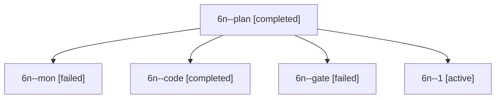

# Session: 6n

[Agent Hoods](../README.md) / [bbugyi200](../users/bbugyi200/README.md) / [apollo](../users/bbugyi200/machines/apollo/README.md) / [6n](../users/bbugyi200/machines/apollo/hoods/6n/README.md) / 6n

Owner: `bbugyi200.apollo` · Hood: `6n` · Members: 5

## Lineage

The diagram is an optional enhancement; the ordered table below contains the same lineage in accessible text.

| Role | Agent | State | Model / provider | Timing | Commits | Prompt | Chat |
|---|---|---|---|---|---:|---|---|
| plan | 6n--plan | completed | gpt-6-astra / codex | 2026-10-10T21:25:58.006868+00:00 → 2026-10-10T21:57:44.078959+00:00 | 0 | [Prompt](../agents/bbugyi200.apollo.6n--plan/prompt.md) | [Chat](../agents/bbugyi200.apollo.6n--plan/chat.md) |
| mon | 6n--mon | failed | gpt-6-luna / codex | 2026-10-10T21:56:48.186521+00:00 → 2026-10-10T22:01:40.175422+00:00 | 0 | — | [Chat](../agents/bbugyi200.apollo.6n--mon/chat.md) |
| code | 6n--code | completed | gpt-6-luna / codex | 2026-10-10T21:30:58.264377+00:00 → 2026-10-10T21:57:44.078959+00:00 | 0 | — | [Chat](../agents/bbugyi200.apollo.6n--code/chat.md) |
| gate | 6n--gate | failed | gpt-6-astra / codex | 2026-10-10T21:30:34.098523+00:00 → 2026-10-10T21:30:45.621363+00:00 | 0 | — | [Chat](../agents/bbugyi200.apollo.6n--gate/chat.md) |
| 1 | 6n--1 | active | gpt-6-luna / codex | 2026-10-10T22:01:39.767706+00:00 | [1](../agents/bbugyi200.apollo.6n--1/README.md#commits) | [Prompt](../agents/bbugyi200.apollo.6n--1/prompt.md) | — |

## Commits

| Role | Repo | Commit | Subject | Committed |
|---|---|---|---|---|
| 1 | bob-cli | [`b0795ac`](https://github.com/bobs-org/bob-cli/commit/b0795ac3308e812c8fe8ffd283edad3e1edcb219) | feat(capture): prioritize percent URL listen intent | 2026-10-10 18:05:55 EDT |
