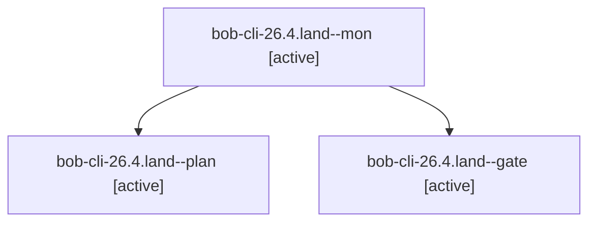

# Session: bob-cli-26.4.land

[Agent Hoods](../README.md) / [bbugyi200](../users/bbugyi200/README.md) / [apollo](../users/bbugyi200/machines/apollo/README.md) / [bob-cli-26](../users/bbugyi200/machines/apollo/hoods/bob-cli-26/README.md) / bob-cli-26.4.land

Owner: `bbugyi200.apollo` · Hood: `bob-cli-26` · Members: 3 · Bead: [bob-cli-26.4](https://github.com/bobs-org/bob-cli--beads/blob/main/pages/bob-cli-26/bob-cli-26.4.md)

## Lineage

The diagram is an optional enhancement; the ordered table below contains the same lineage in accessible text.

| Role | Agent | State | Model / provider | Timing | Commits | Prompt | Chat |
|---|---|---|---|---|---:|---|---|
| mon | bob-cli-26.4.land--mon | active | grok-4.7 / grok | 2026-09-26T22:20:09.368454+00:00 | 0 | — | [Chat](../agents/bbugyi200.apollo.bob-cli-26.4.land--mon/chat.md) |
| plan | bob-cli-26.4.land--plan | active | grok-4.7 / grok | 2026-09-26T21:57:37.690470+00:00 | 0 | [Prompt](../agents/bbugyi200.apollo.bob-cli-26.4.land--plan/prompt.md) | [Chat](../agents/bbugyi200.apollo.bob-cli-26.4.land--plan/chat.md) |
| gate | bob-cli-26.4.land--gate | active | grok-4.7 / grok | 2026-09-26T22:20:04.318719+00:00 | 0 | — | [Chat](../agents/bbugyi200.apollo.bob-cli-26.4.land--gate/chat.md) |

## Neighbors

| Agent | Relation | State |
|---|---|---|
| [bob-cli-26.4.1](../agents/bbugyi200.apollo.bob-cli-26.4.1/README.md) | bob-cli-26.4 hood | active |
| [bob-cli-26.4.2](../agents/bbugyi200.apollo.bob-cli-26.4.2/README.md) | bob-cli-26.4 hood | active |
| [bob-cli-26.4.3.1](../agents/bbugyi200.apollo.bob-cli-26.4.3.1/README.md) | bob-cli-26.4 hood | active |
| [bob-cli-26.4.3.land](../agents/bbugyi200.apollo.bob-cli-26.4.3.land/README.md) | bob-cli-26.4 hood | active |
| [bob-cli-26.1](../agents/bbugyi200.apollo.bob-cli-26.1/README.md) | bob-cli-26 hood | active |
| [bob-cli-26.2](../agents/bbugyi200.apollo.bob-cli-26.2/README.md) | bob-cli-26 hood | active |
| [bob-cli-26.3](../agents/bbugyi200.apollo.bob-cli-26.3/README.md) | bob-cli-26 hood | active |
| [bob-cli-26.land](bbugyi200.apollo.bob-cli-26.land.md) (session · 3) | bob-cli-26 hood | active 3 |
