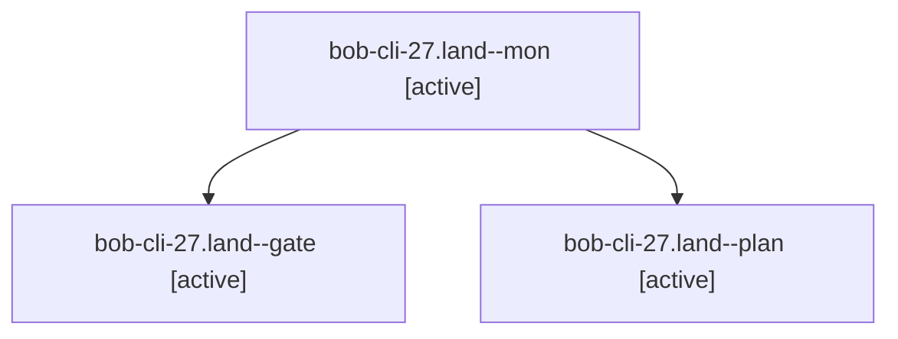

# Session: bob-cli-27.land

[Agent Hoods](../README.md) / [bbugyi200](../users/bbugyi200/README.md) / [apollo](../users/bbugyi200/machines/apollo/README.md) / [bob-cli-27](../users/bbugyi200/machines/apollo/hoods/bob-cli-27/README.md) / bob-cli-27.land

Owner: `bbugyi200.apollo` · Hood: `bob-cli-27` · Members: 3 · Bead: [bob-cli-27](https://github.com/bobs-org/bob-cli--beads/blob/main/pages/bob-cli-27/README.md)

## Lineage

The diagram is an optional enhancement; the ordered table below contains the same lineage in accessible text.

| Role | Agent | State | Model / provider | Timing | Commits | Prompt | Chat |
|---|---|---|---|---|---:|---|---|
| mon | bob-cli-27.land--mon | active | grok-4.7 / grok | 2026-09-27T00:02:53.450617+00:00 | 0 | — | [Chat](../agents/bbugyi200.apollo.bob-cli-27.land--mon/chat.md) |
| gate | bob-cli-27.land--gate | active | grok-4.7 / grok | 2026-09-27T00:02:47.952111+00:00 | 0 | — | [Chat](../agents/bbugyi200.apollo.bob-cli-27.land--gate/chat.md) |
| plan | bob-cli-27.land--plan | active | grok-4.7 / grok | 2026-09-26T23:49:24.115164+00:00 | 0 | [Prompt](../agents/bbugyi200.apollo.bob-cli-27.land--plan/prompt.md) | [Chat](../agents/bbugyi200.apollo.bob-cli-27.land--plan/chat.md) |

## Neighbors

| Agent | Relation | State |
|---|---|---|
| [bob-cli-27.1](../agents/bbugyi200.apollo.bob-cli-27.1/README.md) | bob-cli-27 hood | active |
| [bob-cli-27.2](../agents/bbugyi200.apollo.bob-cli-27.2/README.md) | bob-cli-27 hood | active |
| [bob-cli-27.3](../agents/bbugyi200.apollo.bob-cli-27.3/README.md) | bob-cli-27 hood | active |
| [bob-cli-27.4.1](../agents/bbugyi200.apollo.bob-cli-27.4.1/README.md) | bob-cli-27 hood | active |
| [bob-cli-27.4.land](../agents/bbugyi200.apollo.bob-cli-27.4.land/README.md) | bob-cli-27 hood | active |
