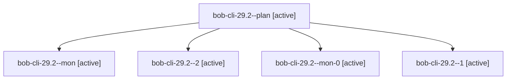

# Session: bob-cli-29.2

[Agent Hoods](../README.md) / [bbugyi200](../users/bbugyi200/README.md) / [apollo](../users/bbugyi200/machines/apollo/README.md) / [bob-cli-29](../users/bbugyi200/machines/apollo/hoods/bob-cli-29/README.md) / bob-cli-29.2

Owner: `bbugyi200.apollo` · Hood: `bob-cli-29` · Members: 5 · Bead: [bob-cli-29.2](https://github.com/bobs-org/bob-cli--beads/blob/main/pages/bob-cli-29/bob-cli-29.2.md)

## Lineage

The diagram is an optional enhancement; the ordered table below contains the same lineage in accessible text.

| Role | Agent | State | Model / provider | Timing | Commits | Prompt | Chat |
|---|---|---|---|---|---:|---|---|
| plan | bob-cli-29.2--plan | active | gpt-6-luna / codex | 2026-09-28T10:52:44.430675+00:00 | 0 | [Prompt](../agents/bbugyi200.apollo.bob-cli-29.2--plan/prompt.md) | [Chat](../agents/bbugyi200.apollo.bob-cli-29.2--plan/chat.md) |
| mon | bob-cli-29.2--mon | active | gpt-6-luna / codex | 2026-09-28T11:19:12.200238+00:00 | 0 | — | [Chat](../agents/bbugyi200.apollo.bob-cli-29.2--mon/chat.md) |
| 2 | bob-cli-29.2--2 | active | gpt-6-luna / codex | 2026-09-28T11:23:10.081107+00:00 | [1](../agents/bbugyi200.apollo.bob-cli-29.2--2/README.md#commits) | [Prompt](../agents/bbugyi200.apollo.bob-cli-29.2--2/prompt.md) | [Chat](../agents/bbugyi200.apollo.bob-cli-29.2--2/chat.md) |
| mon-0 | bob-cli-29.2--mon-0 | active | gpt-6-luna / codex | 2026-09-28T11:22:01.688710+00:00 | 0 | — | [Chat](../agents/bbugyi200.apollo.bob-cli-29.2--mon-0/chat.md) |
| 1 | bob-cli-29.2--1 | active | gpt-6-luna / codex | 2026-09-28T11:20:07.812746+00:00 | 0 | [Prompt](../agents/bbugyi200.apollo.bob-cli-29.2--1/prompt.md) | [Chat](../agents/bbugyi200.apollo.bob-cli-29.2--1/chat.md) |

## Commits

| Role | Repo | Commit | Subject | Committed |
|---|---|---|---|---|
| 2 | bob-cli | [`25b2bf1`](https://github.com/bobs-org/bob-cli/commit/25b2bf16cba0fd3c21df120a835f771f63f2c71f) | feat(capture): add Pomodoro linked task close effects | 2026-09-28 07:33:44 EDT |

## Neighbors

| Agent | Relation | State |
|---|---|---|
| [bob-cli-29.1](../agents/bbugyi200.apollo.bob-cli-29.1/README.md) | bob-cli-29 hood | active |
| [bob-cli-29.3](../agents/bbugyi200.apollo.bob-cli-29.3/README.md) | bob-cli-29 hood | active |
| [bob-cli-29.4](../agents/bbugyi200.apollo.bob-cli-29.4/README.md) | bob-cli-29 hood | active |
| [bob-cli-29.5](../agents/bbugyi200.apollo.bob-cli-29.5/README.md) | bob-cli-29 hood | active |
| [bob-cli-29.6.1](../agents/bbugyi200.apollo.bob-cli-29.6.1/README.md) | bob-cli-29 hood | active |
| [bob-cli-29.6.2](../agents/bbugyi200.apollo.bob-cli-29.6.2/README.md) | bob-cli-29 hood | active |
| [bob-cli-29.6.land](../agents/bbugyi200.apollo.bob-cli-29.6.land/README.md) | bob-cli-29 hood | active |
| [bob-cli-29.land](bbugyi200.apollo.bob-cli-29.land.md) (session · 3) | bob-cli-29 hood | active 3 |
